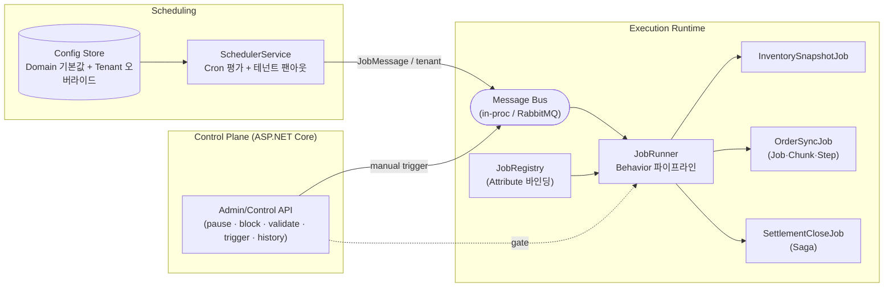

# FlowForge

**분산 작업 스케줄링 & 오케스트레이션 플랫폼** — .NET 8 레퍼런스 구현

> 실무에서 단독 설계·개발·운영한 **통합 스케줄러 플랫폼**과 **WMS 오케스트레이션 플랫폼(MSA)** 의
> 핵심 아키텍처 패턴만 떼어내, 회사 코드 없이 일반 도메인으로 처음부터 새로 구현한 오리지널 코드베이스입니다.
> 외부 인프라 없이 `dotnet run` 한 번으로 스케줄링·팬아웃·오케스트레이션·보상 트랜잭션·운영 제어가
> **실제로 동작**하며, 프로덕션 어댑터(RabbitMQ·Redis·PostgreSQL·Seq)는 인터페이스와 docker-compose로 매핑해 두었습니다.

*English TL;DR: a dependency-light .NET 8 reference implementation of a config-driven job scheduler and a
message-based orchestration engine (two-tier config inheritance, a common job pipeline, attribute-bound handlers,
Job→Chunk→Step partitioning, saga compensation, idempotency/outbox, and three-tier operator control). Runs end-to-end
in-memory; swap in RabbitMQ/Redis/Postgres for production.*

---

## 이 프로젝트가 보여주는 것

| 설계 패턴 | 무엇을 해결하나 | 코드 |
|---|---|---|
| **2계층 설정 상속** (Domain 기본값 + Tenant 오버라이드) | 브랜드/테넌트 추가가 **코드 수정·배포 없이 설정 등록만으로** 완료 | [`ConfigResolver`](src/FlowForge.Core/Configuration/ConfigResolver.cs) |
| **공통 Job 베이스 + Behavior 파이프라인** | 로깅·검증·게이트·멱등성·재시도·타임아웃·이력을 **상위 계층에서 한 번에** 통일, 파생 잡은 비즈니스 로직만 구현 | [`Behaviors`](src/FlowForge.Core/Jobs/Behaviors.cs) · [`JobBase`](src/FlowForge.Core/Jobs/JobBase.cs) |
| **Attribute 바인딩 엔진** | `[JobHandler("key")]` 만 붙이면 스케줄러·메시지 버스에 **자동 등록** (중앙 등록 목록 편집 불필요) | [`HandlerBinder`](src/FlowForge.Core/Jobs/JobRegistry.cs) |
| **Job → Chunk → Step 분산 처리** | 대량 배치를 청크 단위 병렬 처리, 실패를 **아이템·청크 단위로 격리** | [`ChunkedJobProcessor`](src/FlowForge.Core/Orchestration/ChunkedJobProcessor.cs) |
| **Saga 보상 트랜잭션** | 한 트랜잭션으로 못 묶는 다중 시스템 처리를 **성공/실패/역보상**으로 자동 제어 | [`SagaRunner`](src/FlowForge.Core/Orchestration/SagaRunner.cs) |
| **멱등성 · Outbox** | 중복 메시지 차단, 상태-발행 원자성 보장(유실 방지) | [`Resilience`](src/FlowForge.Core/Resilience/InMemoryStores.cs) |
| **3단 운영 제어** | 전역 일시정지 · 도메인/테넌트 차단 · 검증(dry-run) 모드 → **개발자 개입 없이 운영자 직접 대응** | [`OperationalGate`](src/FlowForge.Core/Operations/InMemoryOperationalGate.cs) |
| **Cron 팬아웃 스케줄러** | 등록 비용은 도메인 수로 유지, 실행만 테넌트 단위로 팬아웃 | [`SchedulerService`](src/FlowForge.Scheduler/SchedulerService.cs) |

## 아키텍처



실행 파이프라인 (바깥 → 안쪽):

```
Logging → History → OperationalGate → Idempotency → Retry → Timeout → [Handler]
```

각 관심사는 [`IJobBehavior`](src/FlowForge.Abstractions/Jobs/Jobs.cs) 하나로 분리되어 **모든 잡 타입에 동일하게** 적용됩니다.
자세한 내용은 [docs/ARCHITECTURE.md](docs/ARCHITECTURE.md), 설계 근거는 [docs/DESIGN-DECISIONS.md](docs/DESIGN-DECISIONS.md).

## 빠른 시작

필요: .NET 8+ SDK (레퍼런스 빌드는 net8.0 타깃, 상위 런타임에서도 실행)

```bash
git clone https://github.com/JoonSYun/flowforge.git
cd flowforge
dotnet run --project src/FlowForge.Api
# → http://localhost:8080  (브라우저로 열면 엔드포인트 가이드)
```

시작하면 스케줄러가 즉시 도는 것을 로그로 볼 수 있습니다. 확인해 볼 것들:

```bash
# 도메인 + 테넌트별 병합된 실효 설정
curl localhost:8080/jobs

# 수동 트리거 (테넌트 전체 팬아웃)
curl -X POST localhost:8080/jobs/settlement.close/trigger

# 실행 이력 (최신순)
curl localhost:8080/executions

# 3단 운영 제어
curl -X POST localhost:8080/control/pause
curl -X POST "localhost:8080/control/block?job=order.sync&tenant=brand-c"
curl -X POST "localhost:8080/control/validation?enabled=true"
```

### 실제 실행 결과 (검증됨)

```
order.sync/brand-a   Succeeded  40 synced / 0 failed across 4 chunk(s)   26ms
order.sync/brand-c   Failed     35 synced / 5 failed across 4 chunk(s)  249ms   ← 청크/스텝 실패 격리
settlement.close/brand-a  Succeeded  settlement closed
settlement.close/brand-b  Failed     rolled back at 'issue-invoice': ...     ← Saga 역보상
inventory.snapshot/seoul  Succeeded  snapshot:SEL-01 (142 SKUs)              ← 테넌트별 설정 상속
inventory.snapshot/busan  Succeeded  snapshot:PUS-01  (cron */30 오버라이드)
# 전역 일시정지 시:  Skipped — platform is globally paused
# 검증 모드 시:      Skipped — Validation mode, side effects suppressed
```

## 프로젝트 구조

```
src/
  FlowForge.Abstractions   계약(인터페이스·모델·Attribute) — 의존성 없음
  FlowForge.Core           엔진: 설정 병합, Behavior 파이프라인, Saga, Outbox/멱등성, 인메모리 버스·스토어, 바인딩
  FlowForge.Scheduler      Cronos 기반 Cron 평가 + 테넌트 팬아웃
  FlowForge.Sample         제네릭 예제 도메인 3종 (단순 / 배치 / Saga)
  FlowForge.Api            컨트롤 플레인 + 인메모리 워커 호스트 (실행 가능한 데모)
tests/
  FlowForge.Tests          설정 병합 · Saga 보상 · 청크 처리 단위 테스트
docs/                      ARCHITECTURE.md · DESIGN-DECISIONS.md
docker-compose.yml         프로덕션 인프라 프로파일 (RabbitMQ · Redis · PostgreSQL · Seq)
```

## 인메모리 → 프로덕션 매핑

레퍼런스 빌드는 인프라 없이 돌도록 인메모리 구현이 기본이며, **모든 어댑터는 인터페이스 하나 뒤에** 있습니다.
프로덕션 전환은 DI 등록만 교체하면 됩니다.

| 관심사 | 레퍼런스 (기본) | 프로덕션 어댑터 |
|---|---|---|
| 메시지 버스 | `InProcessMessageBus` (Channel) | RabbitMQ + MassTransit |
| 멱등성/분산락 | `InMemoryIdempotencyStore` | Redis (`SET NX`) |
| 설정/이력/Outbox | `InMemory*Store` | PostgreSQL / MS SQL Server (Dapper·EF Core) |
| 로깅 | 콘솔 | Serilog → Seq |
| 게이트웨이 | (해당 없음) | YARP |

```bash
docker compose up -d   # rabbitmq · redis · postgres · seq
```

## 테스트

```bash
dotnet test    # 10 passed
```

## 기술 스택

.NET 8 · ASP.NET Core (Minimal API) · Cronos · `Microsoft.Extensions.*` (Hosting/DI/Logging) ·
xUnit — 프로덕션 프로파일: RabbitMQ · Redis · PostgreSQL/MS SQL Server · Serilog+Seq · YARP · Polly

## 라이선스

[MIT](LICENSE)
