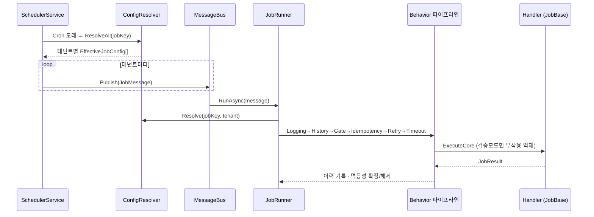

# 아키텍처

FlowForge는 두 개의 실무 플랫폼에서 공통으로 쓰인 설계를 하나의 일관된 런타임으로 합친 것입니다.

- **스케줄링 축** — 설정 기반으로 도메인을 등록하고, Cron 시점에 테넌트로 팬아웃한다.
- **오케스트레이션 축** — 메시지로 실행을 분산하고, 대량 작업을 분할·보상하며, 장애를 정상 흐름으로 흡수한다.

두 축은 **하나의 실행 파이프라인**과 **하나의 설정 모델** 위에서 만납니다.

## 계층

```
FlowForge.Abstractions   계약만 (인터페이스 · 레코드 · Attribute). 다른 것에 의존하지 않는다.
        ▲
FlowForge.Core           모든 엔진과 인메모리 인프라 구현.
        ▲
FlowForge.Scheduler      Cron 평가 + 팬아웃 (Core 위).
FlowForge.Sample         [JobHandler] 로 바인딩되는 제네릭 도메인.
        ▲
FlowForge.Api            컨트롤 플레인 + 워커 호스트 (조립 지점).
```

의존성은 항상 안쪽(Abstractions)을 향합니다. 도메인/호스트는 Core를 알지만 Core는 도메인을 모릅니다 —
도메인은 **런타임에 리플렉션으로 발견**됩니다.

## 실행 흐름



핵심: **팬아웃은 등록 시점이 아니라 발사(fire) 시점에 일어난다.** 도메인은 한 번 등록되고,
테넌트가 몇 개든 스케줄 등록 비용은 도메인 수로 유지됩니다. 실행만 테넌트 단위로 갈라집니다.

## 설정 모델 (2계층 상속)

```
JobDefinition (도메인 기본값)   ← 변하지 않는 실행 규칙
        └─ merge ─┐
TenantOverride (테넌트)         ← 변하는 것만, 필드 단위로 (null = 상속)
        ▼
EffectiveJobConfig             ← 실행에 쓰이는 병합 결과
```

- 오버라이드의 모든 필드는 **nullable** 이고, null이면 도메인 기본값을 상속합니다.
- 파라미터는 **얕은 병합**(shallow merge): 테넌트가 지정한 키만 덮어쓰고 나머지는 상속.
- 새 테넌트/도메인 투입은 **행(row) 추가** 로 끝나며 코드·배포가 필요 없습니다.

병합 규칙 전체는 [`ConfigResolver.Merge`](../src/FlowForge.Core/Configuration/ConfigResolver.cs) 한 곳에 있습니다.

## Behavior 파이프라인

공통 관심사는 각각 하나의 `IJobBehavior` 로 분리되고, `Order` 순으로 합성됩니다
(바깥 → 안쪽):

| Order | Behavior | 책임 |
|---|---|---|
| 0 | Logging | 시작/종료/소요시간 구조적 로깅 |
| 10 | ExecutionHistory | 이력 행 기록(관리 콘솔이 읽음) |
| 20 | OperationalGate | 일시정지/차단/검증 3단 판정 |
| 30 | Idempotency | 중복 스킵, 실패 시 클레임 해제 |
| 40 | Retry | `RetryPolicy` 에 따른 재시도 (각 시도마다 타임아웃 새로 부여) |
| 50 | Timeout | 시도별 타임아웃 → 취소를 실패 결과로 변환 |

파생 잡([`JobBase`](../src/FlowForge.Core/Jobs/JobBase.cs))은 `ExecuteCoreAsync`(그리고 선택적으로
`ValidateAsync`/`CompensateAsync`)만 구현합니다. 나머지는 프레임워크가 감쌉니다.

Retry가 Timeout 바깥에 있는 이유: **시도마다 독립적인 타임아웃**을 주기 위해서입니다.
Idempotency가 Retry 바깥에 있는 이유: 한 실행을 **한 번만** 클레임하고, 재시도는 그 안에서 돌리기 위해서입니다.

## Attribute 바인딩 엔진

`[JobHandler("order.sync")]` 가 붙은 클래스를 [`HandlerBinder`](../src/FlowForge.Core/Jobs/JobRegistry.cs)가
어셈블리 스캔으로 발견하여:

1. DI에 핸들러 타입을 등록하고 (실행 스코프마다 새 인스턴스),
2. `JobRegistry` 에 `jobKey → 타입` 을 기록하고,
3. 시작 시 [`JobBindingService`](../src/FlowForge.Core/Jobs/JobBindingService.cs)가 버스에 `jobKey` 구독을 건다.

새 도메인 추가 = **핸들러 작성 + Attribute 부착.** 중앙 등록 목록을 편집할 필요가 없습니다.

## 오케스트레이션

- **Job → Chunk → Step** ([`ChunkedJobProcessor`](../src/FlowForge.Core/Orchestration/ChunkedJobProcessor.cs)):
  대량 아이템을 청크로 분할, 청크를 제한된 병렬도로 처리, 아이템 실패는 스텝에 격리되어
  나쁜 한 건이 배치를 침몰시키지 않습니다.
- **Saga** ([`SagaRunner`](../src/FlowForge.Core/Orchestration/SagaRunner.cs)):
  스텝을 순방향 실행하다 실패하면 **완료된 스텝을 역순으로 보상**합니다. 보상 실패는
  `CompensationFailed` 로 별도 보고되어 수동 개입 지점을 남깁니다.

## 장애 내성

- **멱등성/인박스**: 같은 실행 키는 한 번만 클레임됩니다(중복 스킵). 프로덕션에선 Redis 분산락.
- **Outbox**: 상태 변경과 발행 의도를 함께 스테이징하고, 디스패처가 미발행 행을 버스로 흘려보냅니다
  ("상태는 커밋됐는데 메시지는 유실" 방지). 프로덕션에선 DB 트랜잭션과 동일 트랜잭션.
- **큐/워커 격리**: 인프로세스 버스는 `jobKey` 마다 채널+펌프를 두어, 한 잡의 실패가 다른 큐를 막지 않습니다.

## 3단 운영 제어

[`IOperationalGate`](../src/FlowForge.Abstractions/Operations/Operations.cs)는 매 실행 직전에 평가됩니다.

1. **전역 일시정지** — 외부 점검에 따른 전면 중단.
2. **도메인/테넌트 차단** — `jobKey` 차단은 전체 테넌트, `jobKey::tenant` 차단은 한 테넌트.
3. **검증 모드** — 경로는 전부 태우되 부작용은 커밋하지 않음(신규 도메인 프로덕션 시범 가동).

세 가지 모두 API로 즉시 토글되며 개발자 개입·배포가 필요 없습니다.

## 프로덕션 어댑터

모든 인메모리 구현은 인터페이스 하나 뒤에 있으므로, DI 등록만 바꾸면 됩니다:

```csharp
services.AddFlowForgeCore(typeof(OrderSyncJob).Assembly);
services.AddSingleton<IMessageBus, RabbitMqMessageBus>();       // 인프로세스 → RabbitMQ
services.AddSingleton<IIdempotencyStore, RedisIdempotencyStore>();
services.AddSingleton<IConfigStore, SqlConfigStore>();          // → PostgreSQL / MS SQL
```

`docker compose up -d` 로 RabbitMQ·Redis·PostgreSQL·Seq를 띄울 수 있습니다(어댑터 구현은 연습 과제로 남겨둠).
