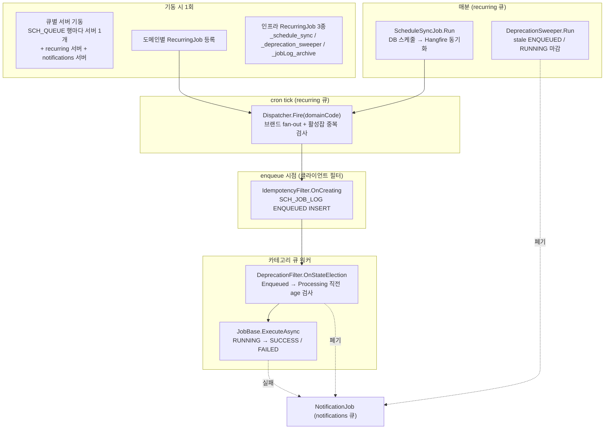
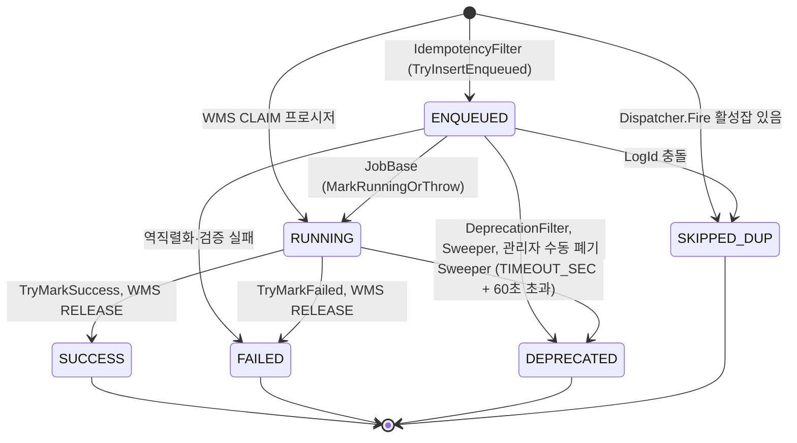
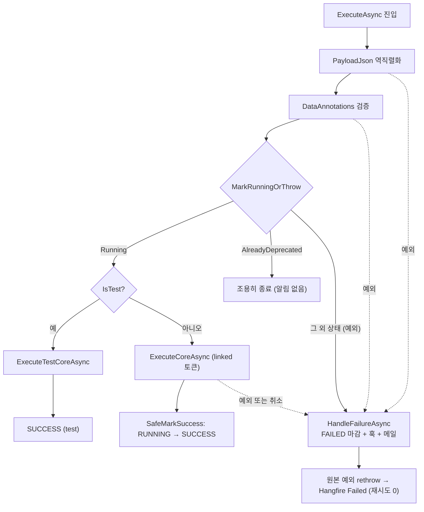
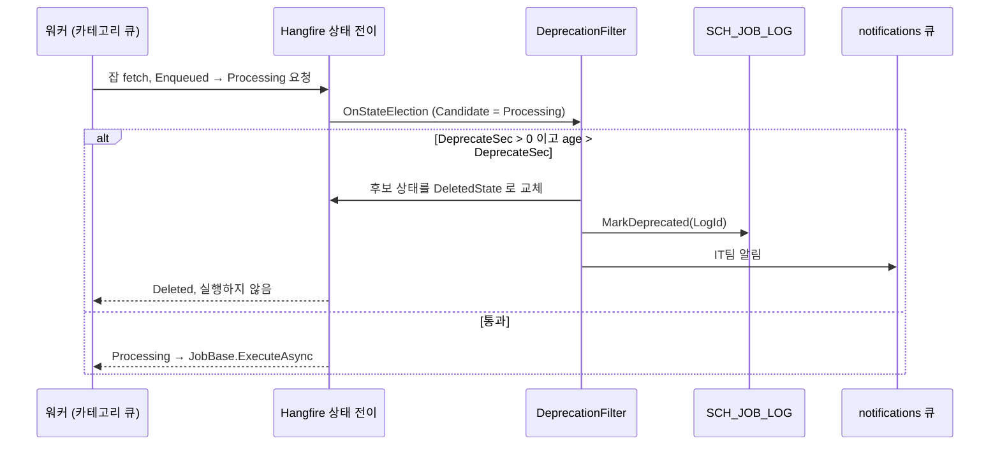
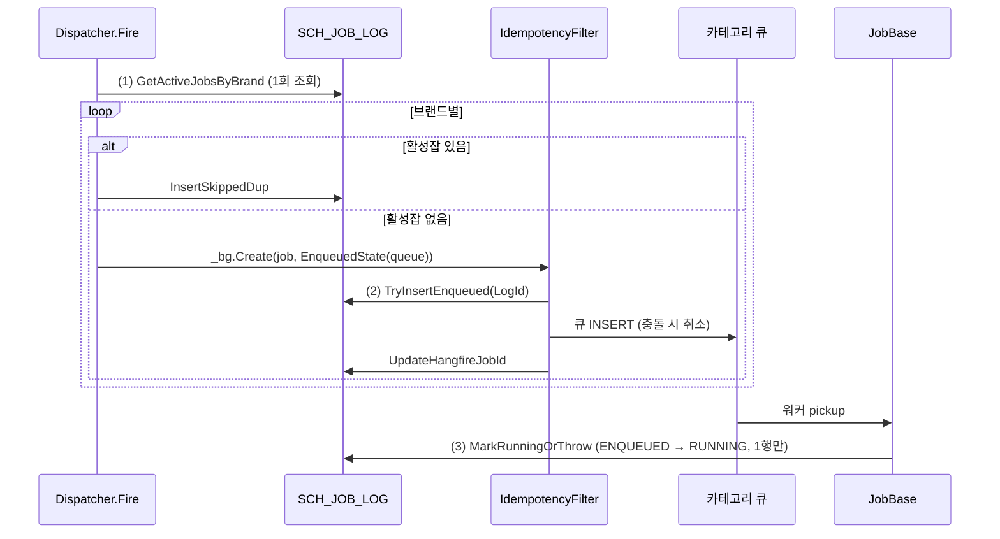
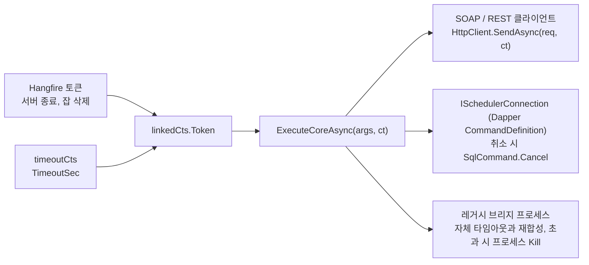
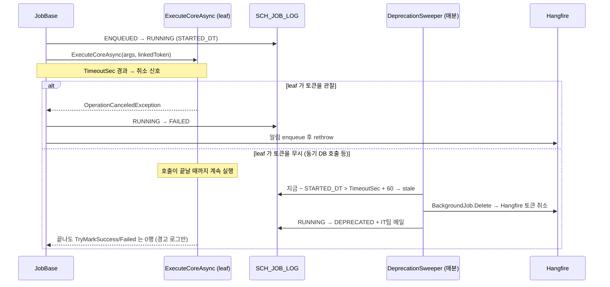
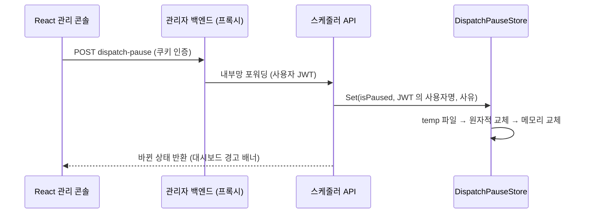

# 통합 스케줄러 코어 — 설계 문서

> [프로젝트 1] 통합 스케줄러 플랫폼의 **코어 실행 엔진**(JOB 등록, 큐 격리, CRON 관리, 공통 Job 베이스)이 어떻게 설계되었고 **왜 그렇게 만들었는지** 정리한 문서입니다.
> 팀 코드리뷰용으로 작성한 구조 설명 자료를 포트폴리오용으로 다듬었습니다. 코드 블록은 운영 코드 원문 발췌이며, 흐름을 보이기 위해 주석·로그 문과 일부 줄을 줄이고 `// (생략)` 으로 표시했습니다. 파일 링크가 없는 블록(큐별 서버 기동, 일시정지 저장소, WMS 잠금 프로시저)은 저장소에 포함하지 않은 파일의 발췌입니다.
>
> **스택** .NET 8 · Hangfire 1.8 (SQL Server 스토리지) · Cronos · EF Core / Dapper · Polly · Serilog + Seq
> **규모** 단독 설계·개발·운영 · 운영 전환 3개월 만에 75개 도메인 / 34개 브랜드 · 파생 Job 69종 · 누적 70만 건 시스템 예외 0건

---

## 목차

1. [전체 구조](#1-전체-구조)
2. [JOB 등록 — 문자열에서 클래스까지](#2-job-등록--문자열에서-클래스까지)
3. [큐 격리 — 큐별 BackgroundJobServer](#3-큐-격리--큐별-backgroundjobserver)
4. [CRON 관리 — 기동 등록, 매분 동기화, 2단 cron](#4-cron-관리--기동-등록-매분-동기화-2단-cron)
5. [공통 Job 베이스 — JobBase 라이프사이클](#5-공통-job-베이스--jobbase-라이프사이클)
6. [늦은 잡 폐기 — DeprecationFilter](#6-늦은-잡-폐기--deprecationfilter)
7. [중복 실행 방지 — 4겹 체크](#7-중복-실행-방지--4겹-체크)
8. [실행 시간 한도 — 협조적 취소](#8-실행-시간-한도--협조적-취소)
9. [전역 일시정지 — cron 발사 차단](#9-전역-일시정지--cron-발사-차단)

---

## 1. 전체 구조

도메인당 RecurringJob 1개가 cron tick 마다 `Dispatcher.Fire` 를 부른다. Dispatcher 는 브랜드별로 잡을 쪼개 카테고리 큐에 넣고, 워커는 `JobBase` 를 상속한 도메인 Job 을 실행한다. 이 흐름 앞뒤에 Hangfire 필터 3종과 매분 도는 인프라 잡 2종이 붙는다.



### 1.1 Hangfire 용어

| 용어 | 뜻 | 이 시스템에서 |
|---|---|---|
| Job | "어떤 클래스의 어떤 메서드를 어떤 인자로" 를 직렬화해 DB 에 저장한 실행 단위 | (도메인, 브랜드) 1회 실행 = 잡 1건 |
| Queue | 실행 대기 잡이 줄 서는 곳 | 카테고리 큐, `recurring`, `notifications` |
| Server / Worker | 앱 안의 백그라운드 처리기 / 그 안의 실행 스레드 | 큐마다 서버 1개 |
| RecurringJob | cron + 호출할 메서드를 저장한 예약 정의 | 도메인마다 1개 |
| Filter | 잡 생성·상태 전이 지점에 끼어드는 확장 지점 | 필터 3종 (1.2절) |

### 1.2 구조 수준의 결정

| 선택 | 이유 |
|---|---|
| RecurringJob 은 도메인당 1개, 브랜드는 Dispatcher 가 실행 시점에 fan-out | 브랜드별 RecurringJob 은 개수가 도메인 × 브랜드로 는다. fan-out 이면 브랜드 추가·중지가 DB 조회만으로 반영된다 |
| 잡 1건 = (도메인, 브랜드) 1회 실행 | 한 브랜드가 실패해도 다른 브랜드는 영향이 없다. 레거시의 "브랜드별 try-catch 부분 성공" 을 재시도 0 정책과 충돌 없이 풀었다 |
| Hangfire 상태와 별도로 `SCH_JOB_LOG` 를 둠 | 관리 콘솔 조회(도메인·브랜드·요청자·테스트 여부), 중복 실행 검사, WMS 잠금 공유의 기준. Hangfire 성공 잡은 1일 뒤 지워지지만 `SCH_JOB_LOG` 는 7일 보관 후 아카이브된다 |

**Hangfire 필터 체인**

| 필터 | 인터페이스 | 끼어드는 시점 | 역할 |
|---|---|---|---|
| `AutomaticRetryAttribute` (Attempts=0) | 내장 | 잡 실패 시 | 재시도 끔. `SCH_JOB_LOG` 1행 = 시도 1회 |
| [`IdempotencyFilter`](2.ExecutionPipeline/Infrastructure/Hangfire/IdempotencyFilter.cs) | `IClientFilter` | 큐 INSERT 직전/직후 | ENQUEUED 행 생성, Hangfire JobId 연결 |
| [`DeprecationFilter`](2.ExecutionPipeline/Infrastructure/Hangfire/DeprecationFilter.cs) | `IElectStateFilter` | Enqueued → Processing 직전 | 큐 대기 한도 초과 잡을 Deleted 로 바꿔 실행 차단 |
| `StateExpirationFilter` | `IApplyStateFilter` | Succeeded/Deleted 적용 직후 | Hangfire Job 보존기간 일괄 지정 (Hangfire 1.8 은 정적 기본값이 없어 필터 경유) |

### 1.3 SCH_JOB_LOG 상태 머신



---

## 2. JOB 등록 — 문자열에서 클래스까지

DB 에는 클래스 이름만 저장하고(`SCH_DOMAIN.JOB_TYPE = "DBReindexJob"`), 실행 시점에 이름을 타입으로 바꿔 Hangfire 잡을 만든다.

| 선택 | 이유 |
|---|---|
| JOB_TYPE 에 **짧은 클래스명** 저장 | 초기에는 네임스페이스 포함 전체 이름 + `Type.GetType` 이었다. 네임스페이스를 옮기면 DB 값도 고쳐야 했다. 어셈블리 스캔으로 바꾸고, 대가로 짧은 이름 유일성을 기동 시 강제한다 |
| 제네릭 `Enqueue<T>(x => ...)` 대신 `new Job(type, method, args)` | 클래스가 DB 문자열로 실행 시점에 정해지므로 컴파일 타임 람다를 쓸 수 없다 |
| 인자를 `JobArgs` 하나로 묶고 설정값을 **스냅샷** | 잡이 큐에서 기다리는 동안 설정이 바뀌어도 판정 기준이 흔들리지 않는다. 판정 때 핫테이블에 설정 테이블을 JOIN 하지 않아도 된다 (데드락 표면 축소) |
| Job 을 Transient 로 등록 | 베이스가 `Param` 등 실행별 상태를 필드로 들고 있어 실행마다 새 인스턴스가 필요하다 |

### 2.1 이름 → 타입: DomainJobRegistry

[`Core/DomainJobRegistry.cs#L28`](2.ExecutionPipeline/Core/DomainJobRegistry.cs#L28)

```csharp
public DomainJobRegistry()
{
    var jobInterface = typeof(IDomainJob);
    var groups = jobInterface.Assembly.GetTypes()
        .Where(t => !t.IsAbstract && !t.IsInterface && t.IsClass && t.IsPublic
                    && !t.ContainsGenericParameters
                    && jobInterface.IsAssignableFrom(t))
        .GroupBy(t => t.Name)
        .ToArray();

    var dupes = groups.Where(g => g.Count() > 1).ToArray();
    if (dupes.Length > 0)
        throw new InvalidOperationException(
            $"[DomainJobRegistry] Duplicate IDomainJob short names: {/* (생략) */}");

    _map = groups.ToDictionary(g => g.Key, g => g.Single(), StringComparer.Ordinal);
}
```

- 짧은 이름이 겹치면 **기동 시점에 실패**(fail-loud)한다. 운영 중 엉뚱한 클래스가 실행될 여지가 없다.

### 2.2 Hangfire 잡 생성: Dispatcher.EnqueueTarget

[`Core/Dispatcher.cs#L307`](2.ExecutionPipeline/Core/Dispatcher.cs#L307)

```csharp
private ManualRunResult EnqueueTarget(TargetRow t, DateTime bucketedDt, bool isManual, RunAsMode? runAs, string requester)
{
    var logId = LogIdFactory.New();
    var effectiveIsTest = t.IsTest || runAs == RunAsMode.Test;

    var jobArgs = new JobArgs
    {
        DomainCode   = t.DomainCode,
        BrandCode    = t.BrandCode,
        PayloadJson  = t.PayloadJson,
        LogId        = logId,
        BucketedDt   = bucketedDt,
        TimeoutSec   = t.TimeoutSec,     // 실행 한도 스냅샷
        DeprecateSec = t.DeprecateSec,   // 큐 대기 한도 스냅샷
        IsTest       = effectiveIsTest,
        // (생략) 센터, 메일 게이트, 요청자
    };

    var jobType = _registry.Resolve(t.JobType);
    var method  = jobType.GetMethod(nameof(IDomainJob.ExecuteAsync))!;

    // CancellationToken.None 은 직렬화용 자리표시자 — 워커 시점에 Hangfire 가 실제 토큰으로 교체한다 (8장)
    var job = new Job(jobType, method, new object[] { jobArgs, CancellationToken.None });

    // EnqueuedState(큐이름) 가 어느 카테고리 큐의 워커가 집을지를 결정한다
    var hangfireJobId = _bg.Create(job, new EnqueuedState(t.DefaultQueue));
    // (생략) 로그, 결과 반환
}
```

1. 실행마다 고유 `LogId` 발급 — `SCH_JOB_LOG` PK 이자 Seq 로그 추적 키.
2. 모든 설정을 이 시점 값으로 `JobArgs` 에 스냅샷.
3. `JOB_TYPE` → 타입 → `ExecuteAsync(JobArgs, CancellationToken)` 으로 Hangfire `Job` 생성.
4. `Create` 순간 `IdempotencyFilter` 가 끼어들어 ENQUEUED 행을 만든다 (7장).

신규 Job 추가는 **클래스 작성 → `AddTransient` 1줄 → `SCH_DOMAIN.JOB_TYPE` 에 클래스명** 3단계다.

---

## 3. 큐 격리 — 큐별 BackgroundJobServer

카테고리(TRACE / RETURN / RECALL …)마다 동시 실행 상한이 달라야 했다. 동시 호출에 약한 외부 API, 같은 브랜드 작업을 순서대로 처리해야 하는 큐는 1개씩만 돌아야 한다. 그리고 한 카테고리가 밀려도 다른 카테고리는 영향이 없어야 한다.

**Hangfire OSS 의 제약** — `WorkerCount` 는 서버 단위다. 워커 10개 서버가 여러 큐를 구독하면, RETURN 잡 10개가 쌓였을 때 워커 10개가 전부 RETURN 으로 몰려 TRACE 가 멈춘다. 큐별 상한은 유료 확장(Hangfire.Pro.Throttling)에만 있다.

**해법: 큐 1개 = 서버 1개.** 각 서버의 `WorkerCount` 를 `SCH_QUEUE.WORKER_COUNT` 로 주면 큐별 동시 픽업 수가 정확히 그 값이 되고, 큐끼리 워커를 나눠 쓰지 않는다.

| 검토한 대안 | 기각 이유 |
|---|---|
| 서버 1개 + 필터에서 큐별 세마포어 대기 | 워커가 슬롯을 점유한 채 기다려 다른 큐까지 막힌다 |
| 서버 1개 + 큐별 DB 락 | 같은 슬롯 낭비에 락 부하까지 |
| Hangfire.Pro.Throttling | 유료이고, 큐 메타데이터가 이미 DB 에 있다 |

대가는 서버가 "카테고리 큐 수 + 2" 로 는다는 것(heartbeat·커넥션 비용)과, 큐 추가·워커 수 변경은 재기동해야 반영된다는 것이다.

```csharp
// 큐별 서버 기동 (발췌)
foreach (var queue in LoadQueueCatalog(configuration))   // SELECT QUEUE_NAME, WORKER_COUNT FROM SCH_QUEUE WHERE USE_YN='Y'
{
    services.AddHangfireServer((sp, options) =>
    {
        options.Queues      = new[] { queue.QueueName };
        options.WorkerCount = queue.WorkerCount;
        options.ServerName  = BuildServerName(queue.QueueName);   // 대시보드에서 큐별로 구분
        ApplyServerSection(options, opt.Server);
    });
}

// Dispatcher.Fire 와 인프라 잡 전용 서버 — 동시성은 appsettings 로만 결정
services.AddHangfireServer((sp, options) =>
{
    options.Queues      = new[] { opt.Recurring.QueueName };
    options.WorkerCount = opt.Recurring.WorkerCount;
    // (생략)
});
```

- DI 컨테이너가 만들어지기 전이라 EF 대신 Dapper 로 1회 조회한다. 조회 실패 시 카테고리 서버 0개로 뜨고 recurring 서버는 유지된다.
- 서버 토폴로지 설명은 [`3.FaultIsolationAndOperations/WorkerTopology.cs`](3.FaultIsolationAndOperations/WorkerTopology.cs) 참고.

| 큐 | 여기서 도는 것 | 동시성 | 분리한 이유 |
|---|---|---|---|
| 카테고리 큐 | 도메인 Job | `SCH_QUEUE.WORKER_COUNT` (기본 1) | 카테고리 간 격리 |
| `recurring` | `Dispatcher.Fire`, 인프라 잡 | 2 | 예전에는 Fire 가 카테고리 큐에서 돌아, WORKER_COUNT=1 큐에서 긴 잡이 끝날 때까지 **발사 자체가 밀렸다** |
| `notifications` | `NotificationJob` (메일) | 2 | SMTP 응답 지연이 업무 워커를 붙잡지 않게 |

| 변경 | 반영 시점 |
|---|---|
| 큐 추가, USE_YN, WORKER_COUNT | 재기동 후 |
| 도메인 DEFAULT_QUEUE, 브랜드 override QUEUE (FK 로 `SCH_QUEUE` 참조) | 다음 Fire 부터 |

---

## 4. CRON 관리 — 기동 등록, 매분 동기화, 2단 cron

cron 은 두 단계로 평가된다.

- **도메인 cron** (`SCH_DOMAIN_SCHEDULE.CRON_EXPR`) — Hangfire RecurringJob 1개로 등록돼 tick 마다 `Dispatcher.Fire` 를 부른다.
- **브랜드 cron** (`SCH_DOMAIN_BRAND_CRON`) — Fire 안에서 브랜드별로 "이번 tick 에 돌지" 를 추가로 좁힌다.

| 선택 | 이유 |
|---|---|
| DB 가 원본, Hangfire 는 복제본 | 관리자 백엔드는 별도 솔루션이고 DB 만 고친다. Hangfire 저장소를 몰라도 스케줄러가 1분 안에 따라온다 |
| 기동 시 전체 등록 + 매분 동기화 | 기동 직후 첫 tick 공백을 없애고, 운영 중 변경은 매분 반영 |
| 동기화를 2단계로 | 활성 여부가 도메인·그룹·매핑·스케줄·유효기간에 흩어져 있는데 변경 체크포인트는 스케줄 테이블에만 있다. 날짜 도래처럼 쓰기 없이 바뀌는 조건도 있어서, "지금 활성인 집합" 과 "등록된 집합" 을 매번 비교해야 모든 경우가 맞는다 |
| 브랜드 cron 은 좁히기만 | RecurringJob 수를 늘리지 않고 "이 브랜드는 업무시간에만" 을 표현 |
| 시간대 KST 고정 | 모든 cron 평가와 시각 비교를 하나의 시간대로 통일 |

### 4.1 매분 동기화: ScheduleSyncJob

[`Core/ScheduleSyncJob.cs#L58`](2.ExecutionPipeline/Core/ScheduleSyncJob.cs#L58)

```csharp
public void Run()
{
    // ─── 1) cron 식 편집 반영 (UPD_DT > SYNCED_UPD_DT 체크포인트) ───
    try
    {
        foreach (var d in _repo.GetChangedSchedules())
        {
            Register(d);
            _repo.MarkSynced(d.DomainCode, d.UpdDt);
        }
    }
    catch (Exception ex)
    {
        // 다음 단계(reconcile)는 막지 않는다.
        _logger.LogError(ex, AppLog.Log("ScheduleSync: changed step failed; continuing to reconcile"));
    }

    // ─── 2) 등록셋 ↔ 활성셋 양방향 reconcile ───
    try
    {
        var activeById = _repo.GetActiveDomainSchedules()
            .ToDictionary(d => d.DomainCode, StringComparer.Ordinal);

        using var conn = JobStorage.Current.GetConnection();
        var registered = conn.GetRecurringJobs()
            .Select(r => r.Id)
            .Where(id => !InfraRecurringJobIds.All.Contains(id))   // 인프라 잡은 삭제 보호
            .ToHashSet(StringComparer.Ordinal);

        foreach (var dead in registered.Where(id => !activeById.ContainsKey(id)).ToList())
            RecurringJob.RemoveIfExists(dead);                      // (a) 더 이상 활성이 아닌 도메인

        foreach (var id in activeById.Keys.Where(id => !registered.Contains(id)).ToList())
            Register(activeById[id]);                               // (b) 활성인데 미등록인 도메인
    }
    catch (Exception ex)
    {
        _logger.LogError(ex, AppLog.Log("ScheduleSync: reconcile failed"));
    }
}
```

| 변화 | 감지 방법 | 처리 단계 |
|---|---|---|
| cron 식 수정 | `UPD_DT > SYNCED_UPD_DT` | 1단계 (AddOrUpdate) |
| 스케줄/도메인 비활성, 삭제 | 활성셋에서 빠짐 | 2단계 dead 제거 |
| 그룹 토글, 그룹 매핑 변경 | 활성셋 변화 | 2단계 dead / missing |
| 유효기간 시작·만료 | 쓰기 없음, 시간 경과 | 2단계 dead / missing |

"활성" 의 정의는 `GetActiveDomainSchedules` **한 곳뿐**이다. 기동 등록과 reconcile 이 같은 정의를 쓴다.

### 4.2 tick 처리: Dispatcher.Fire

[`Core/Dispatcher.cs#L70`](2.ExecutionPipeline/Core/Dispatcher.cs#L70)

```csharp
public void Fire(string domainCode, DateTime? scheduledUtc = null)
{
    var bucketedDt = TruncateToMinute(scheduledUtc ?? DatetimeHelper.Now);

    if (_pauseStore.Current.IsPaused) { /* (생략) 로그 1줄 */ return; }   // 9장

    // OVERRIDE × SCHEDULE × DOMAIN × BRAND JOIN 1회 — 사용 여부·그룹·유효기간 필터, 브랜드 override 병합
    IReadOnlyList<TargetRow> targets = _repo.GetActiveBrandTargets(domainCode, bucketedDt);

    // 도메인 내 ENQUEUED/RUNNING 을 1회 SELECT 로 적재 — 브랜드별 round-trip N → 1
    ActiveJobMap actives = _logs.GetActiveJobsByBrand(domainCode);

    foreach (var t in targets)
    {
        if (!IsAnyFireTime(t.CronExprs, bucketedDt)) { skipped++; continue; }   // 브랜드 cron narrowing
        if (actives.TryGet(t.BrandCode, out var active))                        // 중복 실행 방지 (7장)
        {
            _logs.InsertSkippedDup(/* (생략) */);
            skipped++; continue;
        }
        EnqueueTarget(t, bucketedDt, isManual: false, runAs: null, requester: SchedulerRequester);
        enqueued++;
    }
}
```

`bucketedDt`(현재 시각의 분 절삭)는 이후 모든 판정 — 브랜드 cron, 유효기간, 폐기 나이 — 의 기준 시각이 된다.

### 4.3 브랜드 cron narrowing

[`Core/Dispatcher.cs#L404`](2.ExecutionPipeline/Core/Dispatcher.cs#L404)

```csharp
private static bool IsAnyFireTime(IReadOnlyList<string> cronExprs, DateTime bucketed)
{
    if (cronExprs.Count == 0) return true;

    // GetNextOccurrence 는 strictly-greater — 1분 앞을 기준으로 다음 발생을 구해 bucketed 와 같은지 본다
    DateTimeOffset bucketedOffset = bucketed;
    var prevBoundary = bucketedOffset.AddMinutes(-1);

    foreach (var expr in cronExprs)
    {
        if (string.IsNullOrWhiteSpace(expr)) return true;
        var next = Cronos.CronExpression.Parse(expr).GetNextOccurrence(prevBoundary, TimeZoneInfo.Local);
        if (next.HasValue && next.Value == bucketedOffset) return true;
    }
    return false;
}
```

도메인 cron `*/5 * * * *` 일 때:

| 브랜드 | 브랜드 cron | 실제 발사 |
|---|---|---|
| A | 없음 | 5분마다 |
| B | `0 9-18 * * 1-5` | 평일 9시~18시 정각만 |
| C | `* * * * *` | 여전히 5분마다 (도메인보다 촘촘하게 못 돎) |

---

## 5. 공통 Job 베이스 — JobBase 라이프사이클

모든 도메인 Job 은 `JobBase<TSelf, TParam>` 을 상속하고 `ExecuteCoreAsync` 만 구현한다. 역직렬화, 검증, 상태 전이, 타임아웃, 실패 알림은 베이스가 처리한다.

- **템플릿 메서드 패턴** — Hangfire 가 호출하는 진입점 `ExecuteAsync` 는 베이스에, 업무 로직 자리만 파생 Job 에.
- `TParam` — 도메인·브랜드별 설정 JSON(`PayloadJson`)이 역직렬화될 DTO. 베이스가 `Param` 으로 채워 준다.
- `TSelf` — 파생 클래스 자신(CRTP). `ILogger<TSelf>` 로, 베이스에서 찍은 로그도 어느 Job 인지 구분된다.

| 선택 | 이유 |
|---|---|
| 라이프사이클을 베이스 한 곳에 | Job 69종이 각자 구현하면 누락과 불일치가 생긴다 |
| 재시도 0, 상태는 `SCH_JOB_LOG` 로 직접 | 두 메커니즘이 같이 돌면 상태가 어긋난다. 다시 돌리는 건 다음 tick 이나 수동 실행 |
| 모든 전이에 from-status 가드 | 경합 시 닫힌 행이 되살아나거나 성공이 실패로 뒤집히는 사고를 막는다 |
| 부수효과(마킹, 메일, 훅) 예외는 삼킴 | SMTP 다운 같은 부수 실패가 원본 예외를 가리거나 성공을 실패로 뒤집지 않게 |
| 역직렬화·검증을 RUNNING 전환 전에 | 잘못된 설정은 업무 코드 진입 전에 FAILED 로 끊고, 재현용 입력을 로그에 남긴다 |

[`Core/JobBase.cs#L139`](2.ExecutionPipeline/Core/JobBase.cs#L139)

```csharp
public async Task ExecuteAsync(JobArgs args, CancellationToken ct)
{
    try
    {
        using var _ = LogContext.PushProperty("LogId", args.LogId);

        Param = DeserializePayload(args);   // 실패 시 catch → FAILED
        ValidateParam(args);                // DataAnnotations 일괄 검증
        Logger.LogInformation(AppLog.Log("[{Domain}] {Job} Submit | Param={@Param}"),
            args.DomainCode, JobName, Param);

        // ENQUEUED → RUNNING. 정상 race(DEPRECATED) 만 조용히 종료, 그 외 비정상 상태는 예외
        if (Logs.MarkRunningOrThrow(args.LogId) == MarkRunningOutcome.AlreadyDeprecated)
            return;

        if (args.IsTest) { /* (생략) ExecuteTestCoreAsync → SUCCESS(test) */ return; }

        // Hangfire 토큰 + TimeoutSec 토큰 합성 (8장)
        using var timeoutCts = new CancellationTokenSource(TimeSpan.FromSeconds(args.TimeoutSec));
        using var linkedCts  = CancellationTokenSource.CreateLinkedTokenSource(ct, timeoutCts.Token);

        await ExecuteCoreAsync(args, linkedCts.Token).ConfigureAwait(false);

        SafeMarkSuccess(args);   // 내부 예외는 swallow — 비즈니스는 이미 성공
    }
    catch (BusinessException bex)
    {
        await HandleFailureAsync(args, bex, isBusiness: true).ConfigureAwait(false);
        ExceptionDispatchInfo.Capture(bex).Throw();   // 원본 stack 보존
    }
    catch (Exception ex)
    {
        await HandleFailureAsync(args, ex, isBusiness: false).ConfigureAwait(false);
        ExceptionDispatchInfo.Capture(ex).Throw();
    }
}
```



- **실패는 한 곳으로** — 역직렬화, 검증, 상태 이상, 비즈니스 예외가 전부 catch 두 개로 모이고 [`HandleFailureAsync`](2.ExecutionPipeline/Core/JobBase.cs#L394) 가 똑같이 마감한다.
- **메일 라우팅** — `BusinessException` 이면 브랜드 담당자 + IT팀, 그 외는 IT팀만.
- 파생 Job 예시: [`Jobs/DBReindexJob.cs`](2.ExecutionPipeline/Jobs/DBReindexJob.cs), [`Jobs/MailTestJob.cs`](2.ExecutionPipeline/Jobs/MailTestJob.cs)

### 5.1 상태 전이 가드

모든 전이는 `UPDATE ... WHERE LOG_ID = @id AND STATUS = @from` 형태이고, **영향 행 수로 경합을 판정**한다. 상태 전이 메서드는 Polly 파이프라인([`SqlResiliencePipelineFactory`](2.ExecutionPipeline/Infrastructure/Resilience/SqlResiliencePipelineFactory.cs))으로 DB 일시 오류를 재시도한다.

| 메서드 ([`JobLogRepository`](2.ExecutionPipeline/Infrastructure/JobLogRepository.cs)) | from | to | 0행일 때 |
|---|---|---|---|
| [`TryInsertEnqueued`](2.ExecutionPipeline/Infrastructure/JobLogRepository.cs#L82) | (신규) | ENQUEUED | false → enqueue 취소 |
| [`MarkRunningOrThrow`](2.ExecutionPipeline/Infrastructure/JobLogRepository.cs#L140) | ENQUEUED | RUNNING | DEPRECATED 면 AlreadyDeprecated, 그 외 예외 |
| [`TryMarkSuccess`](2.ExecutionPipeline/Infrastructure/JobLogRepository.cs#L170) | RUNNING | SUCCESS | false → 경고 로그 |
| [`TryMarkFailed`](2.ExecutionPipeline/Infrastructure/JobLogRepository.cs#L211) | ENQUEUED, RUNNING | FAILED | false → 경고 로그 |
| `MarkManyDeprecated` | 지정한 from | DEPRECATED | 건수 차이로 race 확인 |
| [`MarkDeprecated`](2.ExecutionPipeline/Infrastructure/JobLogRepository.cs#L227) | 가드 없음 | DEPRECATED | — |

---

## 6. 늦은 잡 폐기 — DeprecationFilter

큐 적체로 **예정 시각보다 한참 늦게 시작되려는 잡**을 워커가 실행하기 직전에 버린다. 분 단위 발사를 전제로 한 도메인에서 늦게 시작된 잡은 결과 가치가 없고 다음 회차와 겹칠 위험만 크다.

| 선택 | 이유 |
|---|---|
| 워커가 집는 순간(Enqueued → Processing)에 검사 | 늦었는지는 실제로 집히는 순간에만 안다. 여기서 막으면 업무 코드가 한 줄도 돌지 않는다 |
| 기준 시각은 enqueue 시각이 아닌 **예정 시각**(BucketedDt) | enqueue 시각을 쓰면 발사가 밀린 만큼 나이가 초기화돼, 의미 없어진 잡이 더 오래 산다 |
| 대기 한도(`DEPRECATE_SEC`)를 실행 한도(`TIMEOUT_SEC`)에서 분리 | 실행 한도는 크게, 대기 한도는 작게 잡아야 한다. 한 컬럼일 때는 실행 한도 2000초·10분 주기 카테고리의 잡이 큐에서 약 33분 방치돼야 폐기됐다 |
| 0 = 무제한, 기본값 0 (fail-open) | 값을 못 채운 경로가 있어도 정상 잡을 죽이지 않는다. 폐기는 필요한 도메인만 켠다 |
| Filter + Sweeper 두 겹 | Filter 는 워커가 잡을 집어야만 동작한다. 워커가 멎으면 Sweeper 가 매분 SQL 로 대신 닫는다 |

[`Infrastructure/Hangfire/DeprecationFilter.cs#L70`](2.ExecutionPipeline/Infrastructure/Hangfire/DeprecationFilter.cs#L70)

```csharp
public void OnStateElection(ElectStateContext context)
{
    if (context.CandidateState is not ProcessingState) return;

    var args = ExtractJobArgs(context.BackgroundJob.Job);
    if (args == null) return;   // JobArgs 없는 인프라 잡은 대상 아님

    // DeprecateSec == 0 가드가 없으면 age > 0 이 항상 참이라 모든 잡이 즉시 폐기된다
    var ageSec = (DatetimeHelper.Now - args.BucketedDt).TotalSeconds;
    if (args.DeprecateSec <= 0 || ageSec <= args.DeprecateSec) return;

    // [전이 가로채기] 부수효과보다 먼저 — 아래가 어떻게 되든 워커는 이 잡을 실행하면 안 된다
    context.CandidateState = new DeletedState
    {
        Reason = $"DEPRECATED: age={ageSec:F0}s > deprecate={args.DeprecateSec}s"
    };

    // [부수효과 격리] 상태 전이 파이프라인 한복판 — 예외가 새면 잡이 애매한 상태로 남는다
    SafeMarkDeprecated(args, detail);
    SafeNotify(args, detail);
}
```



예: 도메인 cron 10:00, `DEPRECATE_SEC=600`, WORKER_COUNT=1 큐에서 앞선 잡이 12분 걸림 → 10:12 에 집힘 → age 720초 > 600초 → 실행하지 않고 폐기, IT팀 메일.

| 구분 | [DeprecationFilter](2.ExecutionPipeline/Infrastructure/Hangfire/DeprecationFilter.cs) (주 게이트) | [DeprecationSweeper](2.ExecutionPipeline/Core/DeprecationSweeper.cs) ENQUEUED 단계 (백스톱) |
|---|---|---|
| 시점 | 워커가 잡을 집는 순간 | 매분 SQL 스캔 |
| 잡는 경우 | 큐 적체로 늦게 집힌 잡 | 워커가 아예 집지 않는 잡 (워커 멎음, 큐 정체) |
| 판정 | 지금 − BucketedDt > DEPRECATE_SEC | 지금 − SCHEDULED_DT > DEPRECATE_SEC |
| Hangfire 처리 | 후보 상태를 `DeletedState` 로 교체 | `BackgroundJob.Delete` |

---

## 7. 중복 실행 방지 — 4겹 체크

중복 실행이 생길 수 있는 경로는 네 가지다.

1. 이전 회차가 안 끝났는데 다음 tick 이 발사됨
2. 관리자 수동 실행과 cron 발사가 겹침
3. WMS 수신 버튼과 스케줄러가 같은 수신을 동시에 실행
4. 같은 Hangfire 잡이 두 번 집힘 — Hangfire 는 "최소 1회 실행" 만 보장하므로 워커 다운·재배포 시 재픽업될 수 있다

| 겹 | 위치 | 막는 것 | 방식 |
|---|---|---|---|
| (1) 활성잡 검사 | `Dispatcher.Fire` / 수동 실행 경로 | 같은 (도메인, 브랜드) 가 ENQUEUED/RUNNING 인데 또 발사 | 도메인 단위 1회 SELECT 후 분기, 건너뛴 발사도 SKIPPED_DUP 행으로 기록 |
| (2) LogId 멱등 | [`IdempotencyFilter.OnCreating`](2.ExecutionPipeline/Infrastructure/Hangfire/IdempotencyFilter.cs#L34) | 같은 LogId 로 두 번 enqueue | PK INSERT 실패 시 `context.Canceled = true` |
| (3) 실행 진입 가드 | [`MarkRunningOrThrow`](2.ExecutionPipeline/Infrastructure/JobLogRepository.cs#L140) | 같은 행의 이중 실행 (재픽업) | `UPDATE ... WHERE STATUS='ENQUEUED'` 원자적 1행 |
| (4) WMS 공유 잠금 | `CLAIM` 저장 프로시저 | WMS 버튼과 스케줄러의 동시 수신 | `UPDLOCK, HOLDLOCK` 트랜잭션 |

| 선택 | 이유 |
|---|---|
| 중복 단위는 (도메인, 브랜드) | 같은 브랜드의 같은 연동이 겹치면 중복 수신·송신이 된다. 다른 브랜드끼리는 병렬 허용 |
| 활성잡은 도메인당 1번만 조회 + 필터드 인덱스 | 분 경계에 여러 도메인이 동시에 발사될 때의 조회 부하와 데드락을 줄인다 |
| ENQUEUED 행은 Dispatcher 가 아니라 **Hangfire 필터**가 만듦 | cron, 수동 실행, 도메인 수동 실행 세 진입점이 모두 같은 `Create` 를 지난다. "큐에 있는 잡은 반드시 로그 행을 가진다" 를 한 곳에서 보장 |
| WMS 는 같은 `SCH_JOB_LOG` 를 프로시저로 점유 | WMS 는 Hangfire 밖의 별도 솔루션이다. 스케줄러가 이미 보는 활성잡 행을 공유하는 것이 연동 범위가 가장 작다 |



[`Infrastructure/JobLogRepository.cs#L140`](2.ExecutionPipeline/Infrastructure/JobLogRepository.cs#L140) — (3) 실행 진입 가드

```csharp
public MarkRunningOutcome MarkRunningOrThrow(string logId) =>
    _retry.Execute(() =>
    {
        using var ctx = _factory.CreateDbContext();

        // [1] from-status 가드 — 정확히 0 또는 1 행만 affected
        var updated = ctx.JobLogs
            .Where(r => r.LogId == logId && r.Status == JobStatus.ENQUEUED)
            .ExecuteUpdate(s => s
                .SetProperty(r => r.Status,    JobStatus.RUNNING)
                .SetProperty(r => r.StartedDt, DatetimeHelper.Now));
        if (updated == 1) return MarkRunningOutcome.Running;

        // [2] 정상 race(스위퍼가 먼저 닫음) 인지 확인
        if (ctx.JobLogs.AsNoTracking().Any(r => r.LogId == logId && r.Status == JobStatus.DEPRECATED))
            return MarkRunningOutcome.AlreadyDeprecated;

        // [3] 그 외 — 행이 없거나 이미 SUCCESS/FAILED/RUNNING
        throw new InvalidOperationException($"[{logId}] MarkRunning failed — row not in ENQUEUED/DEPRECATED");
    });
```

(4) WMS 공유 잠금 — 발췌

```sql
BEGIN TRAN;
-- (DOMAIN_CODE, BRAND_CODE) 활성 행 존재 여부를 키 범위 잠금으로 직렬화 — 동시 CLAIM 두 건의 이중 INSERT 차단
IF EXISTS (
    SELECT 1 FROM dbo.SCH_JOB_LOG WITH (UPDLOCK, HOLDLOCK)
    WHERE DOMAIN_CODE = @DOMAIN_CODE AND BRAND_CODE = @BRAND_CODE
      AND STATUS IN ('ENQUEUED', 'RUNNING'))
BEGIN
    SELECT TOP (1) 'BLOCKED' AS RESULT, LOG_ID AS ACTIVE_LOG_ID, STATUS AS ACTIVE_STATUS
    FROM dbo.SCH_JOB_LOG
    WHERE DOMAIN_CODE = @DOMAIN_CODE AND BRAND_CODE = @BRAND_CODE
      AND STATUS IN ('ENQUEUED', 'RUNNING')
    ORDER BY ENQUEUED_DT DESC;
    COMMIT TRAN; RETURN;
END

INSERT INTO dbo.SCH_JOB_LOG (LOG_ID, DOMAIN_CODE, BRAND_CODE, /* (생략) */ STATUS, TIMEOUT_SEC /* ... */)
VALUES (@LOG_ID, @DOMAIN_CODE, @BRAND_CODE, /* (생략) */ 'RUNNING', @TIMEOUT_SEC /* ... */);
COMMIT TRAN;
```

WMS 가 외부 호출 직전에 RUNNING 행을 넣어 두면 스케줄러의 (1) 활성잡 검사가 이를 보고 건너뛰고, 반대로 스케줄러가 먼저 점유 중이면 WMS 가 BLOCKED 된다. WMS 쪽 RELEASE 가 누락되면 Sweeper 가 `TIMEOUT_SEC + 60초` 뒤 정리한다.

---

## 8. 실행 시간 한도 — 협조적 취소

### 8.1 시간 한도 두 개

| 컬럼 | 의미 | 기준 시각 | 판정 주체 | 0 의 의미 |
|---|---|---|---|---|
| `DEPRECATE_SEC` | 시작 **전** 큐 대기 한도 | 예정 시각 (BucketedDt) | DeprecationFilter, Sweeper ENQUEUED | 무제한 |
| `TIMEOUT_SEC` | 시작 **후** 실행 한도 | 실행 시작 (STARTED_DT) | JobBase 타임아웃 토큰, Sweeper RUNNING (+60초) | 허용 안 함 (1~86400) |

두 값 모두 `브랜드 override ?? 도메인 스케줄` 로 해석되어 `JobArgs` 와 `SCH_JOB_LOG` 에 스냅샷된다.

### 8.2 취소 신호 두 개를 하나로

| 취소 신호 | 언제 울리나 |
|---|---|
| Hangfire 토큰 | 서버 종료(재배포), 잡 삭제(Sweeper, 관리자 폐기) |
| `TIMEOUT_SEC` 토큰 | 실행 시작 후 `TIMEOUT_SEC` 초 경과 |

베이스가 `CreateLinkedTokenSource` 로 둘을 묶는다([`JobBase.cs#L207`](2.ExecutionPipeline/Core/JobBase.cs#L207)). 각 Job 은 받은 토큰 하나를 HTTP·DB 호출에 넘기기만 하면 된다.



DB 호출까지 토큰이 닿게 하려면 Dapper 의 `CommandDefinition` 오버로드를 써야 한다 — [`ISchedulerConnection`](2.ExecutionPipeline/Infrastructure/Database/ISchedulerConnection.cs) 구현:

```csharp
// 토큰이 fire 되면 SqlCommand.Cancel() → attention 패킷으로 서버 단 실행이 중단된다
public Task<T?> QueryFirstOrDefaultAsync<T>(string sql, object? param = null, CommandType commandType = CommandType.StoredProcedure,
                                            int? commandTimeout = null, CancellationToken cancellationToken = default)
{
    var cmd = new CommandDefinition(sql, param, commandTimeout: commandTimeout, commandType: commandType,
                                    cancellationToken: cancellationToken);
    return _conn.QueryFirstOrDefaultAsync<T>(cmd);
}
```

### 8.3 한도를 넘기면



60초 grace 는 정상 종료 직전의 잡을 잘못 닫지 않기 위한 여유다. 운영자에게는 이렇게 안내한다.

- **ENQUEUED 단계 DEPRECATED** = 확실히 실행되지 않았다.
- **RUNNING 단계 DEPRECATED** = 부분 또는 전부 실행됐을 수 있다. Sweeper 는 상태를 닫을 뿐 스레드를 강제로 멈추지 못한다.

---

## 9. 전역 일시정지 — cron 발사 차단

외부 시스템 점검이나 장애 대응 때 **모든 도메인의 cron 자동 발사를 스위치 하나로** 멈춘다.

| 대상 | 일시정지 중 |
|---|---|
| cron 자동 발사 (`Dispatcher.Fire`) | **차단** — 로그 행도 남지 않음 |
| 관리자 수동 실행 | 허용 — 점검 중에도 특정 브랜드를 골라 실행 가능 |
| 이미 큐에 들어간 잡, 실행 중인 잡 | 영향 없음 |
| Hangfire RecurringJob | 그대로 남고 tick 도 울림 — Fire 가 바로 반환할 뿐 |
| 인프라 잡 (동기화, 스위퍼, 아카이브) | 계속 돈다 |

| 선택 | 이유 |
|---|---|
| `Dispatcher.Fire` 입구 **한 곳**에서만 검사 | 모든 cron 발사가 Fire 를 지난다. ENQUEUED 행을 만드는 `IdempotencyFilter` 보다 앞이라 점검 중 로그 행이 쌓이지 않는다 |
| RecurringJob 은 지우지 않음 | 해제하면 다음 tick 부터 바로 원래 스케줄로 돈다. 재등록 절차 없음 |
| 메모리 캐시 | Fire 는 도메인마다 매 tick 이 값을 읽는다. 읽기에 DB·파일 I/O 가 전혀 없게 |
| 파일에 영속, temp 파일 → 원자적 교체 | 재기동해도 유지되고, 쓰는 도중 죽어도 기존 파일이 깨지지 않는다 |
| 파일이 없거나 깨지면 "해제" 로 시작 (fail-open) | 상태 파일 문제로 스케줄러 기동이 막히지 않게 |
| 관리자 백엔드는 파일을 직접 쓰지 않고 스케줄러 API 로 프록시 | 상태의 진실은 스케줄러 프로세스 메모리다. 파일만 바꾸면 반영되지 않는다 |

```csharp
// DispatchPauseStore (발췌)
public DispatchPauseState Current
{
    get
    {
        lock (_lock)
        {
            // 복사본 반환 — 호출자가 원본을 바꿀 수 없다
            return new DispatchPauseState
            {
                IsPaused = _state.IsPaused,
                PausedDt = _state.PausedDt,
                PausedBy = _state.PausedBy,
                Reason   = _state.Reason
            };
        }
    }
}

public void Set(bool isPaused, string? user, string? reason)
{
    var next = new DispatchPauseState
    {
        IsPaused = isPaused,
        // 해제 시에는 마지막 일시정지 기록(누가·언제·왜)을 이력으로 남긴다
        PausedDt = isPaused ? DatetimeHelper.Now : _state.PausedDt,
        PausedBy = isPaused ? (string.IsNullOrWhiteSpace(user) ? "UNKNOWN" : user) : _state.PausedBy,
        Reason   = isPaused ? reason : _state.Reason
    };

    lock (_lock)
    {
        PersistAtomic(next);   // 파일을 먼저 쓰고, 성공해야 메모리를 바꾼다
        _state = next;
    }
}

private void PersistAtomic(DispatchPauseState state)
{
    var tempPath = _absolutePath + ".tmp";
    File.WriteAllText(tempPath, JsonSerializer.Serialize(state, JsonOpts));
    File.Move(tempPath, _absolutePath, overwrite: true);
}
```



- `PausedBy` 는 요청 본문이 아니라 **JWT 에서 꺼낸 사용자 이름**이다. 화면에서 조작할 수 없다.
- 상태 파일은 배포 폴더 밖 고정 경로에 두어, 재배포가 상태를 덮어쓰지 않는다.
- Fire 가 정상 반환하므로 Hangfire 는 그 회차를 성공으로 본다. **일시정지 동안 건너뛴 회차는 해제 후 몰아서 실행되지 않는다** — 의도한 동작이다.

이 스위치는 3단 운영 제어(전역 일시정지 / 도메인·그룹·브랜드·큐 차단 / 검증 모드) 중 1단이다. 전체 모델은 [`3.FaultIsolationAndOperations/OperationalControl/`](3.FaultIsolationAndOperations/OperationalControl/) 참고.

---

관련 문서: [프로젝트 README (담당업무 ↔ 코드 매핑)](README.md) · [저장소 README](../../README.md)
