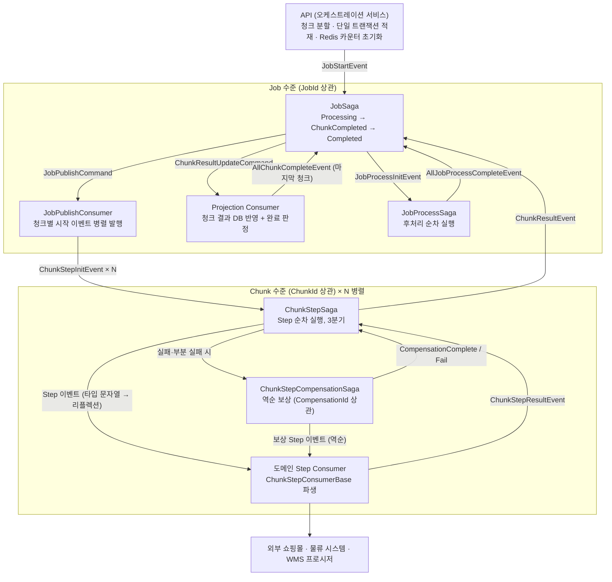
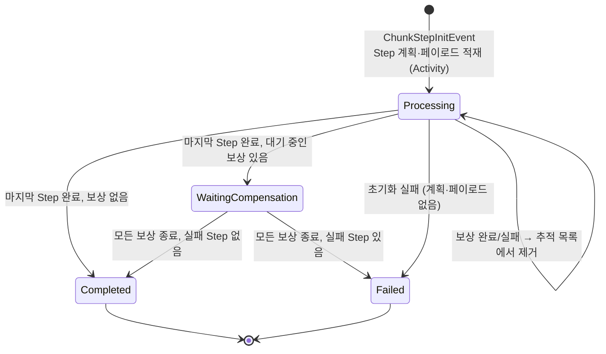

# WMS 오케스트레이션 — 설계 문서

> [프로젝트 2] WMS 오케스트레이션 플랫폼(MSA 전환)의 **분산 실행 엔진**이 어떻게 설계되었고 **왜 그렇게 만들었는지** 정리한 문서입니다.
> 대량 연동 요청을 Job·Chunk·Step 3계층으로 쪼개 메시지로 병렬 처리하고, 성공·부분 성공·실패·보상 흐름을 Saga State Machine 4종으로 제어하는 구조를 다룹니다.
>
> 코드 블록은 운영 코드 원문 발췌이며, 흐름을 보이기 위해 로그 문과 일부 줄을 줄이고 `// (생략)` 으로 표시했습니다. 파일 링크가 있는 블록은 이 저장소의 [`1.DistributedOrchestration/`](1.DistributedOrchestration/) · [`2.BaseFramework/`](2.BaseFramework/) 원문이고, 링크가 없는 블록(진입 서비스, 식별자 배치 락)은 저장소에 포함하지 않은 파일의 발췌입니다. [`3.FaultTolerance/`](3.FaultTolerance/) · [`4.GatewayAndAuth/`](4.GatewayAndAuth/) 는 구조를 요약해 다시 쓴 코드라 이 문서에서는 발췌하지 않았습니다.
>
> **스택** .NET 8 · MassTransit · RabbitMQ · EF Core (Saga 저장소 · Outbox) · Dapper · Redis · Polly · SignalR · YARP
> **규모** 3명 중 오케스트레이션 레이어 · MQ 전체 설계·구현 담당 · 타임아웃·네트워크 장애·DB 락이 겹치는 상황에서도 서버 응답 장애 0건

---

## 요약 — 핵심 설계 결정 8가지

| # | 문제 | 결정 | 결과 |
|---|---|---|---|
| 1 | 수천 건 연동 요청을 한 API 호출 안에서 처리하면 타임아웃과 부분 실패 추적이 불가능 | **Job → Chunk → Step 3계층**으로 쪼개 청크를 메시지로 병렬 처리, API 는 접수만 하고 즉시 반환 | 요청 크기와 무관하게 응답 시간 일정, 실패를 청크·식별자 단위로 추적 |
| 2 | 한 Job 의 병렬 청크 결과가 동시에 들어오면 Saga 낙관적 동시성(Version) 충돌 | JobSaga 는 **상태를 직접 바꾸지 않고 갱신 커맨드만 발행**, DB 갱신은 별도 Consumer 가 트랜잭션으로 | Saga 버전 충돌 없이 청크 결과 집계 |
| 3 | "모든 청크가 끝났는가" 판정이 동시 결과 사이에서 경합 | **Redis Lua 원자 카운터** (GET → INCR → 비교를 한 스크립트로), 키가 없으면 DB 로 판정 | 마지막 청크를 정확히 한 번만 감지 |
| 4 | 외부 API 는 전체 성공·일부 성공·전체 실패를 모두 돌려줌 | Step 결과를 **SUCCESS / PARTIAL_SUCCESS / FAILED 3분기**로 표준화, 부분 실패는 실패 식별자만 추적 | 성공한 건은 다음 Step 으로, 실패한 건만 보상 |
| 5 | 실패 시 앞서 성공한 Step 을 되돌려야 함 | **보상 Saga 를 별도로 띄워 역순으로 하나씩** 실행, 원래 Chunk Saga 는 끝까지 진행 후 `WaitingCompensation` 에서 최종 상태 확정 | 보상 진행과 Step 진행이 서로를 막지 않음, 보상 실패는 완료/건너뜀 인덱스와 함께 알림 |
| 6 | Saga 가 도메인 이벤트 타입을 알면 도메인 추가마다 Saga 수정 | Step 계획은 DB 의 **타입 문자열**, 이벤트는 리플렉션 팩토리로 생성 | Saga 4종은 도메인을 모름 — 도메인 추가 = Consumer + DB 계획 |
| 7 | 도메인 Consumer 마다 멱등성·결과 발행·보상 분기를 각자 구현 | **공통 베이스 클래스**(템플릿 메서드) + **Attribute 바인딩 엔진** | 신규 도메인 = 비즈니스 호출 + 멱등성 조회만, 큐 설정은 DTO Attribute 한 줄 |
| 8 | 메시지 유실·중복, 같은 전표의 동시 처리 | EF Core **Outbox**, 단계별 **상태 기반 멱등성**, **식별자 배치 락**(Redis Lua, 전부 아니면 전무), 층별 Polly 재시도 | 장애가 겹쳐도 중복 반영·유실 없이 복구 |

## 목차

1. [전체 구조](#1-전체-구조)
2. [진입 — Job 생성과 청크 분할](#2-진입--job-생성과-청크-분할)
3. [JobSaga — 병렬 청크 결과 집계](#3-jobsaga--병렬-청크-결과-집계)
4. [ChunkStepSaga — Step 순차 실행과 3분기](#4-chunkstepsaga--step-순차-실행과-3분기)
5. [보상 — ChunkStepCompensationSaga](#5-보상--chunkstepcompensationsaga)
6. [JobProcessSaga — 후처리와 최종 상태](#6-jobprocesssaga--후처리와-최종-상태)
7. [Base Framework — Consumer 공통 베이스](#7-base-framework--consumer-공통-베이스)
8. [Attribute 바인딩 엔진](#8-attribute-바인딩-엔진)
9. [장애 내성 — 층별 방어](#9-장애-내성--층별-방어)
10. [알려진 한계와 다음 과제](#10-알려진-한계와-다음-과제)

---

## 1. 전체 구조

API 는 요청을 청크로 쪼개 DB 에 적재하고 `JobStartEvent` 하나만 발행한 뒤 반환한다. 이후는 전부 메시지로 흐른다.



### 1.1 3계층과 Saga 4종

| 계층 | 단위 | 담당 Saga | 상관 키 | 상태 |
|---|---|---|---|---|
| Job | 요청 1건 (예: 입고 요청 3,000건) | [`JobSaga`](1.DistributedOrchestration/Saga/StateMachine/JobSaga.cs) | JobId | Initial → Processing → ChunkCompleted → Completed |
| Job 후처리 | 모든 청크 완료 후 1회 | [`JobProcessSaga`](1.DistributedOrchestration/Saga/StateMachine/JobProcessSaga.cs) | JobId | Initial → Processing → Completed \| Failed |
| Chunk | 기본 300건 또는 전표 등 복합 키 묶음 | [`ChunkStepSaga`](1.DistributedOrchestration/Saga/StateMachine/ChunkStepSaga.cs) | ChunkId | Initial → Processing → WaitingCompensation → Completed \| Failed |
| Step 보상 | 실패 1회당 1개 | [`ChunkStepCompensationSaga`](1.DistributedOrchestration/Saga/StateMachine/ChunkStepCompensationSaga.cs) | CompensationId | Initial → Compensating → Completed \| Failed |
| Step | 청크 안의 연동 호출 1회 (예: 외부 등록 → WMS 반영) | 도메인 Consumer | — | — |

### 1.2 구조 수준의 결정

| 선택 | 이유 |
|---|---|
| Saga 를 계층마다 따로 둠 (4종) | 한 Saga 가 Job·Chunk·보상을 모두 들면 상태 전이가 폭발하고, 병렬 청크가 한 인스턴스에 몰려 버전 충돌이 난다. 계층별로 나누면 **각 Saga 의 인스턴스는 자기 상관 키로만 갱신**된다 |
| Saga 상태는 EF Core 저장소 + 낙관적 동시성 | [`*StateMap.cs`](1.DistributedOrchestration/Saga/State/) 에서 `Version` 을 동시성 토큰으로 두고 [`MassTransitExtensions`](2.BaseFramework/Messaging/MassTransitExtensions.cs#L48) 에서 `ConcurrencyMode.Optimistic` 으로 등록. 락 없이 동시 수정을 감지한다 |
| 종료 상태에서는 모든 이벤트 `Ignore` | 재전달·지연 도착한 메시지가 끝난 Saga 를 다시 움직이지 않는다. 진행 중 상태의 중복 시작 이벤트도 경고 로그만 남기고 무시한다 |
| DB 를 만지는 부분만 Activity 로 분리 | Step 계획 적재, 결과 갱신은 [`Saga/Activity/`](1.DistributedOrchestration/Saga/Activity/) 로 빼고 Polly 재시도를 건다. 상태 머신 정의는 흐름만 읽히게 둔다 |

---

## 2. 진입 — Job 생성과 청크 분할

오케스트레이션 서비스가 요청을 받아 청크로 쪼갠다. 분할 방식은 세 가지다.

| 진입점 | 분할 기준 | 쓰는 곳 |
|---|---|---|
| `ExecuteBySize` | 고정 크기 (기본 300건) | 순서·묶음이 무관한 대량 등록 |
| `ExecuteByIdentifier` | 복합 키 (예: 전표번호) 로 그룹핑 | 한 전표의 라인이 서로 다른 청크로 흩어지면 안 되는 업무 |
| `ExecuteBypass` | 고정 크기 | 단건성 요청도 같은 비동기 흐름을 타게 함 |

진입 서비스 — 원본 발췌 (저장소 미포함)

```csharp
private async Task<string> ExecuteWithMQ(/* (생략) */)
{
    CreateJobMaster_Command jobMaster = BuildJobMasterCommand(/* (생략) — 요청 헤더의 Idempotency-Key 포함 */);

    // JobMaster + ChunkMaster + ChunkPayload + Step/Process 계획을 한 트랜잭션으로 적재
    await PersistOrchestrationDataAsync(jobMaster, chunkMasters, chunkPayloads, jobId, domainType, options, userId);

    // 청크 완료 카운터 초기화 (Redis, 값 0)
    await InitializeRedisTrackingAsync(jobId);

    // 이후는 전부 메시지 — API 는 여기서 반환
    await PublishJobStartEventAsync(jobId, domainType, totalChunkCount, userId, options);

    // 클라이언트 연결이 끊기면 Job 을 CANCELED 로 중단시키는 이벤트 발행
    RegisterCancellationHandler(httpContext, jobId, options.JobIdentifier);
    return userId;
}
```

| 선택 | 이유 |
|---|---|
| 페이로드는 메시지가 아니라 DB(`ChunkPayload`)에 | 메시지에는 ID 만 싣는다. 브로커 메모리를 페이로드 크기와 분리하고, 재처리 때 원본을 DB 에서 다시 읽을 수 있다 |
| 적재는 단일 트랜잭션, 실패 시 롤백 + 보상 | "Job 은 있는데 청크 일부가 없음" 같은 반쪽 상태를 만들지 않는다 |
| Step 계획을 청크마다 DB 에 적재 | Saga 가 실행할 Step 순서를 코드가 아니라 데이터로 받는다 (4.2절) |
| 요청 연결 종료 시 중단 이벤트 | 호출자가 떠난 Job 을 끝까지 돌리지 않는다. 중단 여부는 Redis 우선, 실패 시 DB 로 확인한다 ([`JobSuspenseService`](1.DistributedOrchestration/Service/JobSuspenseService.cs#L50)) |

청크 시작 이벤트는 [`JobPublishConsumer`](1.DistributedOrchestration/Saga/ProjectionConsumer/JobPublishConsumer.cs#L60) 가 **최대 50개 병렬**로 발행한다. 청크 목록 조회는 페이로드를 빼고 ID 만 읽는다.

---

## 3. JobSaga — 병렬 청크 결과 집계

### 3.1 문제: 병렬 결과와 낙관적 동시성

한 Job 의 청크 10개가 거의 동시에 끝나면 `ChunkResultEvent` 10개가 같은 JobSaga 인스턴스로 들어온다. Saga 가 자기 상태(성공 수 등)를 직접 갱신하면, 같은 `Version` 을 읽은 메시지들 중 첫 번째만 저장되고 나머지는 버전 충돌로 실패한다.

**결정: JobSaga 는 청크 결과를 받아도 자기 상태를 바꾸지 않는다.** 갱신 커맨드만 발행하고, 별도 Consumer 가 DB 트랜잭션으로 반영한다. 코드 머리 주석에 이 이유를 시간순 예시와 함께 남겨 두었다 ([`JobSaga.cs`](1.DistributedOrchestration/Saga/StateMachine/JobSaga.cs)).

[`JobSaga.cs#L314`](1.DistributedOrchestration/Saga/StateMachine/JobSaga.cs#L314)

```csharp
/// CRITICAL: Does NOT update Saga state directly
/// Publishes update command to ChunkResultUpdateCommandConsumer for DB update
private async Task HandleChunkResultAsync(BehaviorContext<JobSagaState, ChunkResultEvent> context)
{
    var saga = context.Saga;
    var msg  = context.Message;

    var cmd = new ChunkResultUpdateCommand
    {
        JobId           = msg.JobId,
        TotalChunkCount = saga.TotalChunkCount,
        ChunkId         = msg.ChunkId,
        Status          = msg.Status,               // ChunkStepSaga 가 확정한 상태를 그대로 신뢰
        ProcessedItemCount = msg.ProcessedItemCount,
        // (생략) 에러 코드·메시지·시각
    };

    await context.Publish(cmd, x => x.CorrelationId = cmd.JobId);
}
```

Saga 상태가 바뀌는 것은 **한 번만 들어오는 이벤트**(Job 시작, 전체 청크 완료, 후처리 완료)뿐이다. 동시에 여러 개가 들어오는 이벤트는 상태를 건드리지 않는다.

### 3.2 마지막 청크 감지: Redis Lua 원자 카운터

"모든 청크가 끝났는가" 는 [`ChunkResultUpdateCommandConsumer`](1.DistributedOrchestration/Saga/ProjectionConsumer/ChunkResultUpdateCommandConsumer.cs) → [`ChunkResultService`](1.DistributedOrchestration/Service/ChunkResultService.cs#L183) 에서 판정한다. 청크 결과를 DB 에 반영(Polly 재시도 + 트랜잭션)한 뒤 카운터를 올린다.

[`JobCompleteChunkRedisManager.cs#L78`](1.DistributedOrchestration/Infrastructure/Redis/JobCompleteChunkRedisManager.cs#L78)

```csharp
// 1) 키 없으면 {0,0}  2) 있으면 INCR 후 전체 청크 수와 비교 — 한 스크립트라 원자적
const string script = @"
    local current = redis.call('GET', KEYS[1])
    if current == false then
        return {0, 0} -- Exists = false, Completed = false
    end
    current = redis.call('INCR', KEYS[1])
    if tonumber(current) >= tonumber(ARGV[1]) then
        return {1, 1} -- Exists = true, Completed = true
    else
        return {1, 0} -- Exists = true, Completed = false
    end";
```

| 선택 | 이유 |
|---|---|
| GET·INCR·비교를 한 Lua 스크립트로 | 애플리케이션에서 "읽고 → 올리고 → 비교" 하면 두 청크가 같은 값을 보고 둘 다 "마지막" 이라 판단하거나 둘 다 놓친다. Redis 는 스크립트를 원자적으로 실행한다 |
| 키가 없으면 INCR 하지 않고 "없음" 반환 | 만료·유실된 키를 새로 만들어 1부터 세면 완료를 영영 못 본다. 없으면 **DB 의 청크 상태로 완료를 판정**한다 |
| 카운터 증가는 DB 반영 **뒤** | 카운터가 완료를 알렸을 때 모든 청크 결과가 이미 DB 에 있어야, 이어서 집계(`GetChunksResultByJobId`)한 성공/부분 성공/실패 수가 맞다 |
| 결과 Consumer 에 청크 단위 멱등성 | 같은 청크 결과가 재전달되면 카운터가 두 번 오른다. 청크 상태가 PENDING 이 아니면 건너뛴다 ([`ChunkIdempotencyService`](2.BaseFramework/Service/ChunkIdempotencyService.cs)) |

마지막 청크를 감지한 Consumer 가 `AllChunkCompleteEvent` 를 발행하면 JobSaga 가 `ChunkCompleted` 로 넘어가며 집계 결과를 자기 상태에 기록하고 JobProcessSaga 를 시작한다 ([`HandleAllChunkCompleteAsync`](1.DistributedOrchestration/Saga/StateMachine/JobSaga.cs#L354)).

---

## 4. ChunkStepSaga — Step 순차 실행과 3분기

청크 하나 안에서 Step 들을 **순서대로** 실행한다. 예: 외부 시스템 등록 → WMS 반영. Step 결과는 셋 중 하나다.

| 결과 | 의미 | ChunkStepSaga 동작 |
|---|---|---|
| SUCCESS | 청크 전체 성공 | 다음 Step |
| PARTIAL_SUCCESS | 일부 식별자만 실패 (실패 식별자 목록 필수) | 실패 식별자만 대상으로 **앞선 Step 보상** Saga 시작 → 다음 Step (실패 식별자는 이후 Step 에서 제외, 7.3절) |
| FAILED | 업무 실패 | 앞선 Step **전체 보상** Saga 시작 → 다음 Step |

### 4.1 실패해도 끝까지 진행하고, 보상을 기다려 최종 상태 확정

[`ChunkStepSaga.cs#L420`](1.DistributedOrchestration/Saga/StateMachine/ChunkStepSaga.cs#L420)

```csharp
private async Task HandleStepFailedAsync(
    BehaviorContext<ChunkStepSagaState, ChunkStepResultEvent> context, ChunkStepResultEvent msg)
{
    var saga = context.Saga;
    saga.IsStepFailed = true;
    // (생략) 에러 정보 기록

    // 앞선 Step 이 있으면 전체 보상 Saga 를 띄우고 추적 목록에 넣는다
    if (msg.StepIndex > 0)
    {
        var compensationId = await StartCompensationSagaForBusinessFailAsync(context, msg.StepIndex);
        if (compensationId != Guid.Empty)
        {
            saga.PendingCompensations.Add(compensationId);
            saga.SyncPendingCompensationsToJson();
        }
    }

    // 실패와 무관하게 다음 Step 으로
    var nextIndex = msg.StepIndex + 1;
    if (nextIndex >= saga.TotalStepCount)
    {
        await HandleLastStepCompletionAsync(context);   // 대기 중인 보상이 있으면 WaitingCompensation
        return;
    }
    await StartNextStepAsync(context, nextIndex);
}
```



최종 상태는 [`CompleteChunkAsync`](1.DistributedOrchestration/Saga/StateMachine/ChunkStepSaga.cs#L876) 한 곳에서 정한다 — 실패 Step 이 하나라도 있으면 FAILED, 부분 성공만 있으면 PARTIAL_SUCCESS, 아니면 COMPLETED. 그 결과를 `ChunkResultEvent` 로 JobSaga 에 보낸다.

| 선택 | 이유 |
|---|---|
| 보상은 별도 Saga, 원래 Saga 는 **ID 목록만 추적** | 보상 진행 상태(몇 번째 Step 까지 되돌렸나)를 ChunkStepSaga 가 들고 있으면 Step 진행과 보상 진행이 한 인스턴스를 두고 경합한다. 분리하면 서로 다른 상관 키로 독립 갱신된다 |
| 보상 대기 목록은 상태에 JSON 으로 영속 | 서비스가 재시작돼도 어떤 보상을 기다리는지 잃지 않는다 |
| 보상이 실패해도 대기 목록에서 제거하고 진행 | 보상 실패 하나가 청크를 영원히 `WaitingCompensation` 에 묶지 않는다. 대신 운영 알림을 발행한다 (5.2절) |
| 2026-01 정책 변경: FAILED 에서 멈추지 않음 | 변경 전에는 업무 실패 시 그 자리에서 청크를 끝냈다. 지금은 모든 Step 을 실행하고, 보상은 Step 진행과 병렬로 돌며, 최종 상태는 모든 Step 과 보상이 끝난 뒤 확정한다 |

### 4.2 Saga 는 도메인을 모른다

Step 계획은 청크별로 DB 에 `(StepIndex, StepType 문자열)` 로 적재되고, Saga 시작 시 [`LoadChunkStepPlanActivity`](1.DistributedOrchestration/Saga/Activity/LoadChunkStepPlanActivity.cs) 가 페이로드와 함께 병렬 조회해 상태에 넣는다. 다음 Step 을 발행할 때는 타입 문자열로 이벤트를 만든다.

[`ChunkStepSaga.cs#L798`](1.DistributedOrchestration/Saga/StateMachine/ChunkStepSaga.cs#L798)

```csharp
private async Task PublishStepExecutionEventAsync(BehaviorContext<ChunkStepSagaState> context, ChunkStepPlanInfo step)
{
    var saga = context.Saga;

    // "WarehousesReqInsertEvent" 같은 타입 문자열 → 인스턴스 (ChunkStepDomainEventBase 파생인지 검증)
    var evt = DomainEventFactory.CreateDomainEvent<ChunkStepDomainEventBase>(step.StepType, _logger, $"ChunkId={saga.ChunkId}");
    evt.MapFromSagaState(saga, step);   // 공통 필드 매핑 (EventMappingExtensions)

    await context.Publish(evt, evt.GetType(), x => x.CorrelationId = saga.ChunkId);
}
```

[`DomainEventFactory`](1.DistributedOrchestration/Saga/Helper/DomainEventFactory.cs) 는 타입을 찾고, 공통 베이스를 상속했는지 확인한 뒤 인스턴스를 만든다. 결과적으로 **Saga 4종은 도메인이 몇 개든 수정되지 않는다.**

---

## 5. 보상 — ChunkStepCompensationSaga

### 5.1 역순으로, 하나씩

보상 대상은 실패한 Step **이전**의 Step 들이고, 인덱스 **내림차순**으로 정렬된다 ([`GetCompensationSteps`](1.DistributedOrchestration/Saga/StateMachine/ChunkStepSaga.cs#L773)). 보상 Saga 는 한 Step 의 보상 완료를 받은 뒤에야 다음 Step 보상을 발행한다.

| 원인 | 보상 대상 식별자 |
|---|---|
| PARTIAL_SUCCESS | 실패한 식별자만 — 성공한 건은 그대로 두고 다음 Step 으로 간다 |
| FAILED | 빈 목록 = 앞선 Step 의 **전체** |

보상도 같은 도메인 Consumer 가 처리한다. 이벤트에 `IsCompensation` 플래그와 `CompensationId` 를 실어 보내면, 베이스 클래스가 정상/보상 모드를 나눠 `CompensateAsync` 를 호출하고 결과를 `CompensationId` 로 돌려준다 (7장).

[`ChunkStepCompensationSaga.cs#L250`](1.DistributedOrchestration/Saga/StateMachine/ChunkStepCompensationSaga.cs#L250)

```csharp
private async Task HandleStepCompletedAsync(
    BehaviorContext<ChunkStepCompensationSagaState, ChunkStepCompensationCompleteEvent> context)
{
    var saga = context.Saga;
    // 1. 완료 기록 — 실패 시 "어디까지 되돌렸나" 를 알리기 위해
    // (생략) CompensatedStepIndexes 에 msg.StepIndex 추가

    var nextIndex = saga.CurrentCompensationIndex + 1;

    // 2. 모두 끝났으면 원래 ChunkStepSaga 로 완료 보고 (ChunkId 로 상관)
    if (nextIndex >= saga.TotalCompensationSteps)
    {
        await PublishCompensationCompleteEventAsync(context);
        await context.TransitionToState(Completed);
        return;
    }

    // 3. 다음 보상 Step 발행 (순차 보장)
    var plan = JsonConvert.DeserializeObject<List<CompensationStepInfo>>(saga.CompensationPlanJson)!;
    saga.CurrentCompensationIndex = nextIndex;
    await PublishCompensationStepEventAsync(context, plan[nextIndex]);
}
```

### 5.2 보상 실패: 멈추고, 무엇이 되돌려졌는지 알린다

보상 Step 하나가 실패하면 보상 Saga 는 바로 `Failed` 로 끝난다. 이어서 되돌리는 것보다 사람이 보고 판단하는 것이 안전하기 때문이다. 대신 실패 이벤트에 **되돌린 Step 인덱스**와 **건너뛴 Step 인덱스**를 함께 싣는다 ([`PublishCompensationFailedAlertAsync`](1.DistributedOrchestration/Saga/StateMachine/ChunkStepCompensationSaga.cs#L398)).

```csharp
var skippedIndexes = plan
    .Skip(saga.CurrentCompensationIndex + 1)
    .Select(s => s.StepIndex)
    .ToList();

var evt = new CompensationFailEvent
{
    // (생략) 식별 정보, 실패 Step, 에러
    FailedIdentifiers      = failedIdentifiers,
    CompensatedStepIndexes = compensatedIndexes,   // 되돌린 Step
    SkippedStepIndexes     = skippedIndexes        // 되돌리지 못한 Step
};
return context.Publish(evt, x => x.CorrelationId = saga.ChunkId);
```

ChunkStepSaga 는 이 이벤트를 받아 보상 대기 목록에서 빼고 `CompensationFailAlertEvent` 를 발행한다. [`CompensationFailAlertConsumer`](1.DistributedOrchestration/Saga/ProjectionConsumer/CompensationFailAlertConsumer.cs) 가 이를 운영 알림(SignalR)으로 보낸다. 운영자는 "어느 청크의 어떤 식별자가, 몇 번 Step 까지 되돌려지고 몇 번 Step 이 남았는지" 를 바로 볼 수 있다.

---

## 6. JobProcessSaga — 후처리와 최종 상태

모든 청크가 끝난 뒤 Job 단위로 한 번 돌아야 하는 작업(집계 반영, 후속 전송 등)을 순차로 실행한다. 후처리 계획도 DB 에서 적재하며([`LoadJobProcessPlanActivity`](1.DistributedOrchestration/Saga/Activity/LoadJobProcessPlanActivity.cs)), 계획이 없으면 즉시 완료한다.

[`JobProcessSaga.cs#L88`](1.DistributedOrchestration/Saga/StateMachine/JobProcessSaga.cs#L88)

```csharp
Initially(
    When(ProcessStart)
        .ThenAsync(InitializeSagaAsync)
        .Activity(x => x.OfType<LoadJobProcessPlanActivity>())
        .IfElseAsync(
            context => Task.FromResult(context.Saga.TotalProcessCount == 0),
            noProcess  => noProcess.ThenAsync(HandleNoProcessAsync).TransitionTo(Completed).Finalize(),
            hasProcess => hasProcess.ThenAsync(StartFirstProcessAsync).TransitionTo(Processing))
        .Catch<Exception>(ex => ex
            .ThenAsync(HandleInitializationFailureAsync)
            .TransitionTo(Failed)
            .Finalize())
);
```

후처리 Consumer 는 [`JobProcessConsumerBase`](2.BaseFramework/Base/JobProcessConsumerBase.cs) 를 상속한다. 예외를 삼키고 성공/실패 **이벤트로** Saga 에 보고하므로, 후처리 실패가 메시지 재시도 폭풍으로 번지지 않는다.

**Job 최종 상태** ([`JobSaga.HandleJobProcessCompletedAsync`](1.DistributedOrchestration/Saga/StateMachine/JobSaga.cs#L399))

| 후처리 결과 | Job 최종 상태 |
|---|---|
| COMPLETED | 청크 집계 결과 그대로 (COMPLETED / PARTIAL_SUCCESS / FAILED) |
| FAILED | FAILED |

확정된 상태는 `JobCompleteUpdateCommand` 로 DB 에 반영되고, 요청자에게 SignalR 알림이 간다. 이 Consumer 도 Job 상태 기반 멱등성(이미 완료된 Job 이면 건너뜀)을 건다.

---

## 7. Base Framework — Consumer 공통 베이스

도메인 Consumer 는 `ChunkStepConsumerBase<TEvent, TPayload>` 를 상속하고 네 개만 구현한다.

| 추상 메서드 | 도메인이 할 일 |
|---|---|
| `ProcessAsync` | 비즈니스 호출 → `StepConsumerResponse` 반환 |
| `CompensateAsync` | 보상 로직 (없으면 no-op) |
| `CheckIdempotencyAsync` | "이미 처리했는가" 를 업무 키로 조회 |
| `CheckCompensationIdempotencyAsync` | "이미 보상했는가" 조회 |

나머지 — 페이로드 역직렬화, 정상/보상 분기, 멱등성 판정 후 처리, 결과 이벤트 표준 발행, 부분 실패 식별자 필터, 외부 응답 코드 변환, 로깅 — 는 베이스가 한다.

### 7.1 진입과 분기

[`ChunkStepConsumerBase.cs#L83`](2.BaseFramework/Base/ChunkStepConsumerBase.cs#L83)

```csharp
public async Task Consume(ConsumeContext<TEvent> context)
{
    var evt = context.Message;

    // 페이로드를 한 번만 파싱 — 형식이 틀리면 즉시 실패 (fail-fast)
    ConvertPayloadsOrThrow(evt);

    if (evt.IsCompensation)
        await HandleCompensationAsync(context).ConfigureAwait(false);
    else
        await HandleProcessAsync(context).ConfigureAwait(false);
}
```

[`ChunkStepConsumerBase.cs#L180`](2.BaseFramework/Base/ChunkStepConsumerBase.cs#L180) — 정상 모드

```csharp
private async Task HandleProcessAsync(ConsumeContext<TEvent> context)
{
    var stopwatch = Stopwatch.StartNew();
    try
    {
        // 이미 결과가 있으면 실행하지 않고, 저장된 결과로 결과 이벤트를 다시 발행
        if (await SkipIfDuplicatedAsync(context).ConfigureAwait(false))
            return;

        var response = await ProcessAsync(context).ConfigureAwait(false);   // 파생 클래스
        stopwatch.Stop();

        // SUCCESS / PARTIAL_SUCCESS / BUSINESS_FAIL 모두 같은 형식의 결과 이벤트로
        await PublishResultEventAsync(context, response, stopwatch.Elapsed).ConfigureAwait(false);
    }
    catch (BusinessException bex)
    {
        stopwatch.Stop();
        var response = StepConsumerResponse.BusinessFail(bex.GetType().Name, bex.Message, bex.InnerException?.ToString() ?? bex.StackTrace);
        await PublishResultEventAsync(context, response, stopwatch.Elapsed).ConfigureAwait(false);
    }
    catch (Exception ex)
    {
        // (생략) 같은 방식으로 FAIL 결과 이벤트 발행 — 10장 참고
    }
}
```

| 선택 | 이유 |
|---|---|
| 예외도 결과 **이벤트**로 바꿔 Saga 에 보고 | Saga 는 결과 이벤트가 와야 다음으로 진행한다. 예외가 Consumer 에서 끝나면 Saga 가 영원히 기다린다 |
| 중복이면 실행은 건너뛰되 **결과 이벤트는 다시 발행** | 결과 이벤트가 유실돼 재전달된 경우, 그냥 건너뛰면 Saga 가 멈춘다. 저장된 결과로 다시 알려야 흐름이 이어진다. 보상 모드도 같다 |
| 결과 상관 키는 ChunkId, 보상 결과는 CompensationId | 베이스가 상관 키를 정하므로 도메인 코드가 Saga 라우팅을 몰라도 된다 |

### 7.2 외부 응답 코드 → Step 결과

외부 연동 API 의 응답 코드 규약을 베이스 한 곳에서 해석한다 ([`GetResult`](2.BaseFramework/Base/ChunkStepConsumerBase.cs#L604)).

| 응답 코드 | Step 결과 |
|---|---|
| `00` | SUCCESS |
| `98` | PARTIAL_SUCCESS — 에러 목록에서 실패 식별자 추출 (없으면 규약 위반으로 예외) |
| `99` | BUSINESS_FAIL |
| 그 외 | 업무 예외 — 운영에서 같은 방식으로 드러나게 |

### 7.3 부분 실패 식별자 필터

앞 Step 이 부분 성공이면, 실패 식별자는 이벤트의 `PartialFailureDetailsJson`(StepIndex → 식별자 목록)으로 다음 Step 에 전달된다. 다음 Step 의 도메인 코드는 [`GetValidPayloads`](2.BaseFramework/Base/ChunkStepConsumerBase.cs#L656) 로 실패 건을 뺀 페이로드만 받는다.

```csharp
protected IList<TPayload> GetValidPayloads(string[] identifierProperties, char separator = OrchestrationConstants.COMPOSITE_KEY_SEPARATOR)
{
    if (FailedIdentifiers == null || FailedIdentifiers.Count == 0)
        return RequestPayload;

    var failedSet = new HashSet<string>(FailedIdentifiers, StringComparer.Ordinal);   // O(1) 조회
    var validPayloads = new List<TPayload>(RequestPayload.Count);
    foreach (var payload in RequestPayload)
    {
        // 식별자 속성 여러 개를 '|' 로 이은 복합 키 (예: 전표번호|라인번호)
        var compositeKey = BuildCompositeKey(payload, identifierProperties, separator);
        if (!failedSet.Contains(compositeKey))
            validPayloads.Add(payload);
    }
    return validPayloads;
}
```

### 7.4 신규 도메인 예시

[`WarehousesReqInsertConsumer`](2.BaseFramework/Consumers/WarehousesReqInsertConsumer.cs) — 비즈니스 호출과 멱등성 조회만

```csharp
public class WarehousesReqInsertConsumer : ChunkStepConsumerBase<WarehousesReqInsertEvent, WarehousesReqList_NT>
{
    protected override async Task<StepConsumerResponse> ProcessAsync(ConsumeContext<WarehousesReqInsertEvent> context)
    {
        RegisterResp resp = await _warehousesReqService.ProcessAsync(
            context.Message.JobId, RequestPayload.ToList(), /* (생략) 업무 코드 */ context.Message.ChunkIndex);
        return GetResult(resp);   // 응답 코드 해석은 베이스
    }

    protected override async Task<(IdempotencyResult, ChunkScopeStatus)> CheckIdempotencyAsync(
        ConsumeContext<WarehousesReqInsertEvent> context)
        => await _idempotencyService.CheckIdempotency(RequestPayload.First()!.docNo, context.Message.ChunkIndex);

    // (생략) 보상·보상 멱등성 — 이 도메인은 no-op
}
```

WMS 프로시저를 실행하는 도메인이 여럿이라, 베이스를 한 번 더 상속한 2단 베이스([`NTISConsumerBase`](2.BaseFramework/Base/NTISConsumerBase.cs))를 두었다. 실행 결과 판정·결과 이력 저장을 2단 베이스가 하고, 도메인은 **어떤 프로시저를 부를지 한 줄**만 쓴다 ([예시](2.BaseFramework/Consumers/NTISWarehouseMasterSyncConsumer.cs)).

같은 방식의 베이스가 계층마다 있다 — Job 커맨드용 [`JobConsumerBase`](2.BaseFramework/Base/JobConsumerBase.cs), 청크 결과용 [`ChunkConsumerBase`](2.BaseFramework/Base/ChunkConsumerBase.cs), 후처리용 [`JobProcessConsumerBase`](2.BaseFramework/Base/JobProcessConsumerBase.cs).

---

## 8. Attribute 바인딩 엔진

메시지 DTO 에 큐 설정을 선언하고, Consumer 에 큐 이름을 선언하면 엔진이 스캔해 수신 엔드포인트를 만든다. **버스 설정 코드를 고치지 않고** 도메인을 추가할 수 있다.

```csharp
// DTO — 이 메시지를 소비하는 큐의 동작
[MassTransitAutoBind(nameof(ConsumerBindingType.CHUNK), prefetchCount: 5, concurrentMessageLimit: 10, retryCount: 1, retryDelaySeconds: 10)]
public class SomeDomainDto { /* ... */ }

// Consumer — 큐 이름
[MassTransitConsumerAutoBind("queue-some-domain")]
public class SomeDomainConsumer : IConsumer<ChunkPayload_Message<SomeDomainDto>> { /* ... */ }
```

[`MassTransitAutoBinder.cs#L250`](2.BaseFramework/Messaging/MassTransitAutoBinder.cs#L250)

```csharp
private static void RegisterReceiveEndpointGeneric<TConsumer, TMessage>(
    IRabbitMqBusFactoryConfigurator cfg, IBusRegistrationContext context, string queueName, MassTransitAutoBindAttribute dtoAttr)
    where TConsumer : class, IConsumer
    where TMessage : class
{
    cfg.ReceiveEndpoint(queueName, e =>
    {
        e.PrefetchCount          = dtoAttr.PrefetchCount;
        e.ConcurrentMessageLimit = dtoAttr.ConcurrentMessageLimit;
        e.SetQueueArgument("x-max-priority", dtoAttr.MaxPriority);   // 우선순위 큐

        // 재시도는 DB 락 예외에만 — 업무 실패를 재시도로 반복하지 않는다
        e.UseMessageRetry(r =>
        {
            r.Handle<DBLockException>();
            r.Interval(dtoAttr.RetryCount, TimeSpan.FromSeconds(dtoAttr.RetryDelaySeconds));
        });

        e.ConfigureConsumeTopology = false;
        e.ConfigureConsumer<TConsumer>(context);
    });
}
```

| 선택 | 이유 |
|---|---|
| 설정은 DTO 에, 큐 이름은 Consumer 에 | 같은 메시지는 어느 Consumer 가 받든 같은 처리 특성(동시성·재시도)을 가져야 한다 |
| Consumer 가 봉투(`ChunkPayload_Message<T>`)를 받아도 설정은 `T` 에서 | 제네릭 인자를 벗겨 원래 DTO 를 찾는다. 도메인 개발자는 봉투를 신경 쓰지 않는다 |
| DB 락 예외만 재시도 | 일시적인 락 경합은 기다리면 풀린다. 업무 실패는 재시도해도 같은 결과라 Saga 의 3분기로 넘긴다 |
| 우선순위 큐로 선언 | 큐를 `x-max-priority` 로 선언하고, 요청 우선순위(동기 요청 / 비동기 배치 기본값 분리)를 Job·청크 이벤트까지 전달한다 |

---

## 9. 장애 내성 — 층별 방어

장애는 층마다 다르게 생긴다. 한 가지 장치로 모두 막으려 하지 않고, 층마다 맞는 장치를 두었다.

| 층 | 생기는 문제 | 장치 | 위치 |
|---|---|---|---|
| 메시지 발행 | DB 는 바뀌었는데 메시지가 안 나감, 또는 반대 | **EF Core Outbox** — 발행을 같은 트랜잭션의 outbox 행으로 남기고 커밋 후 배달, 중복 감지 창 | [`MassTransitExtensions#L103`](2.BaseFramework/Messaging/MassTransitExtensions.cs#L103) |
| 메시지 소비 | 브로커 재전달로 같은 메시지 두 번 | **단계별 상태 기반 멱등성** — Job 은 PENDING 일 때만 발행, 청크 결과는 PENDING 일 때만 반영, Step 은 업무 키로 기존 결과 조회 | [`JobIdempotencyService`](2.BaseFramework/Service/JobIdempotencyService.cs) · [`ChunkIdempotencyService`](2.BaseFramework/Service/ChunkIdempotencyService.cs) · 7.1절 |
| Saga 상태 | 동시 이벤트의 lost update | **낙관적 동시성**(Version) + 동시 이벤트는 상태를 건드리지 않게 설계 | 1.2절 · 3.1절 |
| DB 호출 | 일시적 락·타임아웃 | **Polly 지수 백오프**, 용도별 정책(상태 갱신 / 재조회 / HTTP / Redis)을 설정으로 분리 | [`RetryPolicyFactory`](1.DistributedOrchestration/Infrastructure/Factory/RetryPolicyFactory.cs#L29) |
| 메시지 처리 | 일시적 DB 락 | 엔드포인트 재시도는 `DBLockException` 한정 | 8장 |
| 동시 처리 | 같은 전표가 두 Job 에서 동시에 처리 | **식별자 배치 락** (Redis Lua) | 아래 |
| Redis 장애 | 카운터·중단 여부를 못 읽음 | **DB 폴백** — 청크 완료는 청크 상태로, Job 중단은 중단 테이블로 판정. 락은 실패 정책(`FailOnError` 기본)을 명시 | 3.2절 · [`JobSuspenseService`](1.DistributedOrchestration/Service/JobSuspenseService.cs#L50) · [`RedisLockManager`](2.BaseFramework/Infrastructure/Redis/RedisLockManager.cs) |

### 9.1 식별자 배치 락 — 전부 아니면 전무

같은 전표번호가 두 요청에 섞여 들어오면 두 Job 이 같은 전표를 동시에 처리하게 된다. 요청 하나에 식별자가 수백 개라, 하나씩 락을 잡으면 일부만 잡고 실패했을 때 되돌리는 처리가 복잡해진다. 그래서 **충돌 검사와 획득을 한 Lua 스크립트**로 묶었다.

원본 발췌 (저장소 미포함)

```lua
-- KEYS: lock:{domain} (SET), lock:zset:{domain} (시각 인덱스), lock:job:{jobId} (Job 이 잡은 락 목록)
-- 1) 충돌 검사 — 하나라도 이미 잠겨 있으면 잡지 않고 충돌 목록 반환
for i = 4, #ARGV do
    if redis.call('SISMEMBER', setKey, ARGV[i]) == 1 then
        table.insert(results, ARGV[i])
    end
end
if #results > 0 then
    return results
end

-- 2) 전부 획득 — 도메인별 SET, 만료 정리용 ZSET, Job 별 역색인
for i = 4, #ARGV do
    local id = ARGV[i]
    redis.call('SADD', setKey, id)
    redis.call('ZADD', zsetKey, timestamp, id)
    redis.call('SADD', jobSetKey, domainKey .. ':' .. id)
end
-- (생략) 세 키 모두 TTL
return {}
```

| 선택 | 이유 |
|---|---|
| 검사와 획득을 한 스크립트로 | 검사 후 획득 사이에 다른 요청이 끼어들 틈이 없다 |
| 충돌 시 **충돌한 식별자 목록**을 반환 | 호출자에게 "어느 전표가 처리 중인지" 를 그대로 알려 줄 수 있다 |
| Job 별 역색인 (`lock:job:{jobId}`) | Job 이 끝나면 자기가 잡은 락만 한 번에 해제한다 |
| 시각 ZSET | TTL 과 별개로 오래된 락을 골라 정리할 수 있다 |

---

## 10. 알려진 한계와 다음 과제

| 항목 | 현재 상태 | 계획 |
|---|---|---|
| Step 의 예기치 못한 예외 | 베이스가 BUSINESS_FAIL 결과 이벤트로 바꿔 발행하고 다시 던지지 않는다 (재시도 코드는 주석 상태). Saga 는 멈추지 않지만, 일시 장애도 재시도 없이 업무 실패로 처리된다 | 일시 장애 예외 유형을 분류해 재시도 후 발행 |
| 단일 키 락 해제 | [`RedisLockManager.ReleaseLockAsync`](2.BaseFramework/Infrastructure/Redis/RedisLockManager.cs) 가 소유자 확인 없이 키를 지운다. TTL 이 먼저 만료되고 다른 인스턴스가 잡은 락을 지울 수 있다 | 획득 값(시각·머신명)을 비교하는 Lua 해제로 교체 |
| 청크 완료 카운터 키 유실 | DB 로 판정하지만, 그 뒤 카운터를 복구하지 않아 이후 청크도 매번 DB 판정 (코드에 TODO) | 키 유실 시 DB 값으로 카운터 재구성 |
| 도메인별 보상 구현 | 보상 프레임워크는 완성됐지만 일부 도메인은 `CompensateAsync` 가 no-op 이라, 해당 도메인의 보상 Saga 는 즉시 완료된다 | 외부 시스템에 취소 API 가 있는 도메인부터 순차 구현 |
| 프로시저 도메인의 부분 성공 | 2단 베이스는 프로시저 실패를 전체 실패로만 본다 | 결과 테이블의 행 단위 오류를 PARTIAL_SUCCESS 로 변환 |

---

관련 문서: [프로젝트 README (담당업무 ↔ 코드 매핑)](README.md) · [저장소 README](../../README.md) · [프로젝트 1 설계 문서](../01.UnifiedScheduler/ARCHITECTURE.md)
